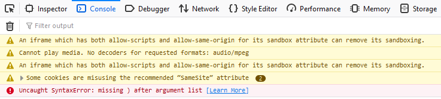
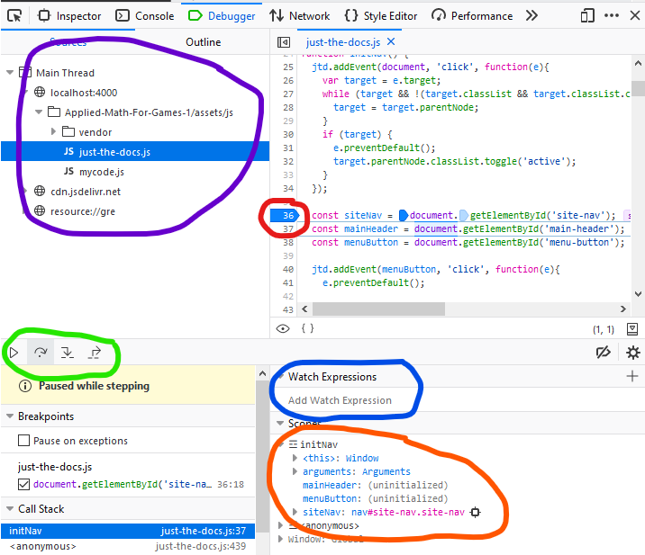

<!--prettier-ignore-start-->
# Debugging 
{: .no_toc }

Tracking down errors in our Javascript code doesn't have to be painful. This section covers debugging tips and techniques.

### Table of Contents
{: .no_toc }

1. TOC
{:toc}

<!--prettier-ignore-end-->

## Three Types of Bugs

_There are three types of bugs..._

**Syntax Errors**, also known as parsing errors, are errors that prevent your program from running. Most syntax errors are caused by mistakes that you make when typing in your code.

```javascript
console.log "This Will Never Print"); // Syntax error. The opening parenthesis is missing.
// Error in console: "Uncaught SyntaxError: unexpected token: string literal"
```

**Run-Time Errors** are errors that occur while your program runs. These typically occur when your program attempts an operation that is impossible to carry out.

<!--prettier-ignore-start-->
```javascript
let people = [{ name: "wally", age: 22 }, { name: "daisy", age: 20 }];
console.log(people[3].age); // Run-time error. Position three of the array is undefined.
// Error in console: "Uncaught TypeError: people[3] is undefined"
```
<!--prettier-ignore-end-->

**Logic Errors** are errors that prevent your program from doing what you intended it to do. Your code may execute and run without errors, but may produce a result(s) that you did not expect.

_...and they are all your fault. ;)_

## How Javascript Programs Display Errors

{:class="small inline"}

Javascript is said to "error silently" meaning that error messages are typically not sent directly to the user by way of the web browser. Instead, you need to open the **developer console** to see any syntax and run-time error message.

In most browsers you can open the dev console using `CTRL-SHIFT-I` and then visiting the "console" tab.

🎵 Note:
{: .label .label-yellow}

Look through error messages carefully for filenames and line numbers.
{: .d-inline-block }

Clicking on filename information in an error message will often load up the file/line where the error occurred in the debugger tab.

## Console Debugging

The easiest way to track down logical errors is to test your assumptions your variables. Having written the code, you should have a good idea of what values your variables should contain at different points in your script.

You can test these assumptions by logging the variables to the developer console:

```javascript
for (const i = 0; i < 10; i++) {
  console.log(i * 2); // Should count in 2s from 0 to 18.
}
```

## The Debugger

{:class="small inline"}

In the debugger tab of the developer console you can:

- Load up your javascript assets (circled in purple).
- Click on the line number to the right of any line of code will set a breakpoint (circled in red).
- When you reload the page, the execution of the Javascript will pause at the line where you've set your breakpoint.
- You can then use the step buttons (circled in green) to run the code line by line.
- You can watch variables as they are updated (circled in orange) and set specify particular variables to watch (circled in blue).

Click on the image to enlarge. The debugger shown here is for Firefox. Chrome and Edge have similar debuggers.

## Further Reading

- [What went wrong? Troubleshooting Javascript](https://developer.mozilla.org/en-US/docs/Learn/JavaScript/First_steps/What_went_wrong)
- [Getting Started with Debugging in Chrome DevTools](https://developers.google.com/web/tools/chrome-devtools/javascript)
- [The Firefox Javascript Debugger](https://developer.mozilla.org/en-US/docs/Learn/Common_questions/What_are_browser_developer_tools#the_javascript_debugger)
