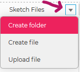

<!-- prettier-ignore-start -->

# Getting Started
{: .no_toc }

[P5.js](https://p5js.org/) is an open source library designed for creative coding originally created by [Lauren Lee McCarthy](https://lauren-mccarthy.com/), and currently led by [Moira Turner](https://github.com/mcturner1995) with the help of a community of collaborators.


p5.js is a web interpretation of [Processing](https://processing.org/), the long-standing creative coding platform based on the Java language. And like Processing, p5.js is supported by the [Processing Foundation](https://processingfoundation.org/).

## Table of Contents
{: .no_toc }

1. TOC
{:toc}

<!-- prettier-ignore-end -->

## First Things First

It's easy to get started with p5.js using the web editor IDE at [editor.p5js.org](https://editor.p5js.org/).

Start by creating an account or logging in using your Github or Google account. You can then explore some of the examples available under the `File` => `Examples` menu.

You can also install p5.js locally. We will look into that option below as well.

🎵 Note:
{: .label .label-yellow}

p5.js programs are called sketches to emphasize the connection to the artistic process.
{: .d-inline-block }

### Resources

- 🔰 [Official Getting Started Guide](https://p5js.org/get-started/)

## Tour of the P5.js Web Editor


A quick tour of the p5.js Web Editor:

1. The coding area.
2. The preview canvas.
3. The sketch run and stop buttons.
4. Sketches can optionally auto-play as you make changes.
5. The saved name of the project.
6. Settings for dark mode, font size, and accessibility.
7. The debugging console.
8. Reveals the project file explorer.

### Handy Hotkeys

- `CTRL-S` - Save File
- `CTRL-F` - Find
- `CTRL-H` - Replace
- `CTRL-SHIFT-F` - Auto Format/Tidy Code
- `CTRL-ENTER` - Run Sketch
- `CTRL-SHIFT-ENTER` - Stop Sketch

## Web Editor Project Structure

Open the web editor "Sketch Files" explore (number 8 in the above tour). You'll see that a p5.js web editor project includes just three files:

- `index.html` - Main HTML file that loads all required JS and CSS files.
- `sketch.js` - Main p5.js sketch file.
- `style.css` - Change how your HTML page and sketch are styled using this CSS file.

The p5.js library itself (along with the sound library) is loaded from the HTML using a version of p5.js hosted on a content delivery network (CDN).

Before uploading image or sounds assets, it's recommended that you create a folder called `assets`.



## Developing p5.js Locally

Although you can [manually download the required p5.js files](https://p5js.org/download/), I prefer to use the p5.vscode extension for Visual Studio Code. This extension is packaged with the Live Server extension, allowing you to easily preview your sketches in a browser.

### Creating a New Project with the p5.vscode Extension

1. Create a new folder for your sketch using the terminal or file explorer.
2. Open the VS Code command pallet (CTRL-SHIFT-P) and type `Create p5.js Project`.
3. Select your newly created project folder from step 1.
4. Add your project folder to your the VS Code workspace.
5. With the `index.html` file open in the editor open the Live Server using ALT-L ALT-O, or by clicking the "Go Live" button in the bottom right-hand corner of the screen.

A browser tab should open to: `127.0.0.1:5500/index.html`

### Resources

- 🧰 [p5.vscode extension](https://marketplace.visualstudio.com/items?itemName=samplavigne.p5-vscode) and 📦 [its github repo](https://github.com/antiboredom/p5.vscode).
- 🧰 [Live Server extension](https://marketplace.visualstudio.com/items?itemName=ritwickdey.LiveServer) and 📦 [its github repo](https://github.com/ritwickdey/vscode-live-server).

## Folder Structure

Overview of the files and folders in a local p5.js project:

- Project Root:
  - index.html - Main HTML file that loads all required JS and CSS files.
  - sketch.js - Main p5.js sketch file.
  - style.css - Change how your HTML page and sketch are styled using this CSS file.
  - jsconfig.json - Needed so that Visual Studio Code can perform proper p5.js intellisense autocompletion.
- `libraries` folder: Location of `p5.min.js`, `p5.sound.min.js`, and other installed contributor libraries.

## Hello World Using p5.js

Create a new p5.js project using the web editor or the local development process described above.

Open the `sketch.js` file and change the `setup()` and `draw()` methods to the following:

```javascript
function setup() {
  createCanvas(255, 255); // Set canvas size to 255 by 255 pixels.
  noStroke(); // Disable the drawing of outlines around shapes.
}

function draw() {
  background(255, 10); // White background with an alpha transparency.
  let oscillation = 127 * sin(frameCount / 100) + 128; // Sinusoidal transition from 1-ish to 255-ish.
  fill(oscillation, 0, 255 - oscillation); // The fill color of the circle.
  circle(mouseX, mouseY, oscillation); // Draw the circle at the current mouse position.
}
```

[Edit using P5.js Web Editor](https://editor.p5js.org/stungeye/sketches/GAMvJ4lBm)

The Result:

<iframe src="https://editor.p5js.org/stungeye/embed/GAMvJ4lBm" scrolling="no" frameborder="no" width="255" height="297"></iframe>

## Setup and Draw

At the heart of every p5.js application are the `setup` and `draw` methods.

- 📜 [`setup()`](https://p5js.org/reference/#/p5/setup) is run once at the start of the program and never again.
- 📜 [`draw()`](https://p5js.org/reference/#/p5/draw) is run over and over, once per frame.

The speed at which p5.js will attempt to call the `draw` method is controlled by the target framerate, which is set by calling 📜 [`frameRate()`](https://p5js.org/reference/#/p5/framerate) in `setup()`.

🎵 Note:
{: .label .label-yellow}

This is also an optional 📜 [`preload()`](https://p5js.org/reference/#/p5/preload) function for preloading assets.
{: .d-inline-block }

### Resources

- 📜 [`frameCount`](https://p5js.org/reference/#/p5/frameCount) - Number of frames displayed since the sketch began.
- 📜 [`millis()`](https://p5js.org/reference/#/p5/millis) - Number of milliseconds since the sketch began.
- 📜 [`deltaTime`](https://p5js.org/reference/#/p5/deltaTime) - Time since previous frame in milliseconds.
