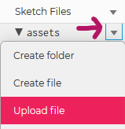

<!-- prettier-ignore-start -->

# Images, Text, and Sound 
{: .no_toc }

This section will demonstrate how to display images, render text, and play sounds.

## Table of Contents
{: .no_toc }

1. TOC
{:toc}

<!-- prettier-ignore-end -->

## Persistent Variables

The variables we've dealt with so far have been function parameters and local variables, both of which go out of scope after each frame. To preserve state across frames we can define global variables outside of the `setup()` and `draw()` functions. 

The next two sections give us the opportunity to work with global variables defined in this manner. 

⚡ Warning:
{: .label .label-red}

Global variables can be a source of hard to find bugs. Use them sparingly.
{: .d-inline-block }

## Preloading Assets

Anytime we are loading a media asset like an image, or a font, or a sound, we need to do so inside of a the special `preload()` function which is called before the `setup()` function.

## Adding Images to a Sketch

Images should be placed into an `assets` folder within your p5.js project. 

If you are using the p5.js web editor you will need to expand the "Sketch Files" area (See [#8 of the p5.js Tour](/Applied-Math-For-Games-1/docs/04-introduction-to-processing/01-getting-started.html#tour-of-the-p5js-web-editor)) and then upload the image:



## Loading Images

With p5.js we can load, display, resize, and manipulate images in png, jpg, or gif format.

First we define a global variable at the top of the file:

```javascript
let ramImage;
```

Images must be loaded in a special `preload()` function:

```javascript
function preload() {
  ramImage = loadImage('assets/goat.png'); // Preload the image.
}
```

In `setup()` we can optionally scale the image:

```javascript
function setup() {
  createCanvas(300, 300);
  // Scale the image by one third:
  ramImage.resize(ramImage.width / 3, ramImage.height / 3); 
  frameRate(1); // One frame per second please.
}
```

And then draw it from within `draw()`:

```cpp
function draw() {
  background(255); // White background
  let xPos = random(0, width - ramImage.width);
  let  yPos = random(0, height - ramImage.height);
  image(ramImage, xPos, yPos); // Place image randomly within canvas.
}
```

[Edit Code Using p5.js Web Editor](https://editor.p5js.org/stungeye/sketches/wiYQhrMBY)

The Result:

<iframe src="https://editor.p5js.org/stungeye/embed/wiYQhrMBY" scrolling="no" frameborder="no"  width="302" height="302"></iframe>

### Resources

- 📜 [`loadImage()`](https://p5js.org/reference/#/p5/loadImage) - Load an image file to a variable.
- 📜 [`image()`](https://p5js.org/reference/#/p5/image) - Draw an image variable to the canvas.
- 📜 [`p5.Image` Class](https://p5js.org/reference/#/p5/p5.Image)
- 🏷️ [Background Image Example](https://p5js.org/examples/image-background-image.html)
- 🏷️ [Image Transparency Example](https://p5js.org/examples/image-transparency.html)
- 🏷️ [Alpha Mask Example](https://p5js.org/examples/image-alpha-mask.html)

## Processing Image Pixels

The RGBA color value of any image pixel can be retrieved and set:

```javascript
let color = ram.get(45, 55); // Get the p5.color value at x = 45 and y = 55
ram.set(5, 10, color('red')); // Set the pixel at (5,10) red.
ram.updatePixels(); // The set() must be paired with an updatePixels().
```

### Resources

* 📜 [`p5.image get()`](https://p5js.org/reference/#/p5.Image/get) - Get and image pixel or region.
* 📜 [`p5.image set()`](https://p5js.org/reference/#/p5.Image/set) - Set and image pixel or region.
* 📜 [`p5.image pixels`](https://p5js.org/reference/#/p5.Image/pixels) - The get/set operations are slow so we can request access to the raw pixel array.

## Simple Text

We can draw text to the screen with a default font using:

```cpp
textSize(30); // Set the text size.
text("Hello Whirled", 100, 200); // Write text to x = 100, y = 200.
fill(0, 102, 153); // Text uses the fill color.
text("Hello Whirled", 100, 240); // Write text to x = 100, y = 240.
```

### Resources

- 📜 [`text()`](https://p5js.org/reference/#/p5/text) - Draw text to the canvas.
- 📜 [`textSize()`](https://p5js.org/reference/#/p5/textSize) and 📜 [`TextAlign()`](https://p5js.org/reference/#/p5/textAlign) - Change size and alignment.

## Text and Fonts

To draw text of any size we need to use a TrueType or OpenFont font.

Grab a font from your `c:\windows\fonts` folder or a free font source like [fontlibrary.org](https://fontlibrary.org) a put it in a `assets` folder in your project. For the sake of example, let's say you grabbed [`lemon.ttf`](https://fontlibrary.org/en/font/lemon).

```javascript
function preload() {
  lemon = loadFont('assets/lemon.ttf'); // Load our TrueType font.
}

function setup() {
  createCanvas(200, 200); // Set the canvas size.
  textFont(lemon); // Set the font to be our lemon.ttf loaded above.
  textSize(width / 8); // Set the font size.
  textAlign(CENTER, CENTER); // Centered horizontal and vertical allignment.
  fill(255); // Draw the text in white.
}

function draw() {
  background(0); // Clear the background in black.
  translate(width / 2, height / 2); // Translate to the middle of the canvas.
  rotate(frameCount / 100); // Rotate based on the frame count.
  text('upsidedown', 0, 0); // Display our text string.
}
```

[Edit Code Using p5.js Web Editor](https://editor.p5js.org/stungeye/sketches/WihYLEDbq)

The Result:

<iframe src="https://editor.p5js.org/stungeye/embed/WihYLEDbq" scrolling="no" frameborder="no"  width="200" height="200"></iframe>

### Resources

- 📜 [`loadFont()`](https://p5js.org/reference/#/p5/loadFont) and 📜 [`textFont()`](https://p5js.org/reference/#/p5/textFont) - Load and set font.
- 📜 [`textWidth()`](https://p5js.org/reference/#/p5/textWidth) - Determine pixel length of text.
- 🏷️ [Draw Grid of Letters Example](https://p5js.org/examples/typography-letters.html)
- 🏷️ [Text Alignment Example](https://p5js.org/examples/typography-words.html)

## P5.js Sounds

p5.js sketches can optionally support the loading and playing of sound files in a variety of formats. If you are developing locally ensure that your `index.html` file is loading the `p5.sound.min.js` file from the `libraries` folder.

Depending on your web browser you should be able to load and play mp3, ogg, wav, and m4a/acc file. For extra compatibility you can provide your sound file in a variety of formats using the 📜 [`soundFormats()`](https://p5js.org/reference/#/p5/soundFormats) function.

## Loading and Playing a Sound

Like images and fonts, you should load sounds in the `preload()` function. 

There's so much you can do with sounds in p5.js, but here we'll simply show how to load and play an mp3 file in the `assets` folder:

```javascript
let kaChing;

function preload() {
  kaChing = loadSound('assets/ka-ching.mp3'); // Preload the sound.
}

function setup() {
  createCanvas(200, 200); // Set the canvas size.
}

function draw() {
  if (kaChing.isPlaying()) {
    background(0, 255, 0); // Green while sound is play.
  } else {
    background(255, 0, 0); // Red while sound is not playing.
  }
}

function mousePressed() {
    kaChing.play(); // Play sound on mouse click.
}
```

[Edit Code Using p5.js Web Editor](https://editor.p5js.org/stungeye/sketches/c9RUrmBvu)

The Result:

<iframe src="https://editor.p5js.org/stungeye/embed/c9RUrmBvu" scrolling="no" frameborder="no"  width="200" height="200"></iframe>

### Resources

- 📜 [`loadSound()`](https://p5js.org/reference/#/p5/loadSound)
- 📜 [`play()`](https://p5js.org/reference/#/p5.SoundFile/play)
- 📜 [`pause()`](https://p5js.org/reference/#/p5.SoundFile/pause)
- 📜 [`stop()`]https://p5js.org/reference/#/p5.SoundFile/stop)
- 📜 [`loop()`](https://p5js.org/reference/#/p5SoundFile/loop)
- 📜 [The Full `p5.sound` API](https://p5js.org/reference/#/libraries/p5.sound) - SO MUCH MOAR!
- 🏷️ [Playback Rate Example](https://p5js.org/examples/sound-playback-rate.html)
- 🏷️ [Frequency Analysis of Microphone Example](https://p5js.org/examples/sound-frequency-spectrum.html)
- 🏷️ [Sound Generation with Oscillator Example](https://p5js.org/examples/sound-oscillator-frequency.html)
- 🏷️ [Many More Examples Under "Sound"](https://p5js.org/examples/)
