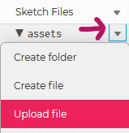

<!-- prettier-ignore-start -->

# Images, Text, and Sound
{: .no_toc }

This section will demonstrate how to display images, render text, and play sounds.

## Table of Contents
{: .no_toc }

1. TOC
{:toc}

<!-- prettier-ignore-end -->

## Persistent Variables

The variables we've dealt with so far have been function parameters and local variables. Variables created inside a function can only be accessed within that function, and local variables in `draw()` are recreated each frame.

To preserve state across frames, or to share a value between functions, we can define global variables outside of the `setup()` and `draw()` functions.

The next sections give us the opportunity to work with global variables defined in this manner.

⚡ Warning:
{: .label .label-red}

Global variables can be a source of hard to find bugs. Use them sparingly.
{: .d-inline-block }

## Loading Assets

Images, fonts, sounds, and other external files take time to load.

In p5.js v2, assets are loaded using `await` inside an `async setup()` function. The sketch waits at the `await` statement until the asset has finished loading.

For example:

```javascript
let ramImage;

async function setup() {
  createCanvas(300, 300);

  ramImage = await loadImage("assets/goat.png");
}
```

Older p5.js v1 sketches often use a special `preload()` function instead. New p5.js v2 sketches should use `async` and `await`.

## Adding Images to a Sketch

Images should be placed into an `assets` folder within your p5.js project.

If you are using the p5.js web editor you will need to expand the "Sketch Files" area (See [#8 of the p5.js Tour](/Applied-Math-For-Games-1/docs/04-introduction-to-processing/01-getting-started.html#tour-of-the-p5js-web-editor)) and then upload the image:



## Loading Images

With p5.js we can load, display, resize, and manipulate images in PNG, JPG, or GIF format.

First we define a global variable at the top of the file:

```javascript
let ramImage;
```

Then we load the image using `await` inside an `async setup()` function:

```javascript
async function setup() {
  createCanvas(300, 300);

  ramImage = await loadImage("assets/goat.png");

  // Scale the image by one third:
  ramImage.resize(ramImage.width / 3, ramImage.height / 3);

  frameRate(1); // One frame per second please.
}
```

And then draw it from within `draw()`:

```javascript
function draw() {
  background(255); // White background.

  let xPos = random(0, width - ramImage.width);
  let yPos = random(0, height - ramImage.height);

  image(ramImage, xPos, yPos); // Place image randomly within canvas.
}
```

[Edit Code Using p5.js Web Editor](https://editor.p5js.org/stungeye/sketches/wiYQhrMBY)

The Result:

<iframe src="https://editor.p5js.org/stungeye/embed/wiYQhrMBY" scrolling="no" frameborder="no" width="300" height="342"></iframe>

### Resources

- 📜 [`loadImage()`](https://p5js.org/reference/p5/loadImage/) - Load an image file.
- 📜 [`image()`](https://p5js.org/reference/p5/image/) - Draw an image to the canvas.
- 📜 [`p5.Image` Class](https://p5js.org/reference/p5/p5.Image/)
- 📜 [`background()`](https://p5js.org/reference/p5/background/) - Can also use a `p5.Image` as the canvas background.
- 📜 [`tint()`](https://p5js.org/reference/p5/tint/) - Apply color or transparency to an image.
- 📜 [`p5.Image.mask()`](https://p5js.org/reference/p5.Image/mask/) - Use another image as an alpha mask.
- 🏷️ [More p5.js Examples](https://p5js.org/examples/)

## Processing Image Pixels

The RGBA color value of any image pixel can be retrieved and changed:

```javascript
let pixelColor = ramImage.get(45, 55); // Get the color at x = 45 and y = 55.

ramImage.set(5, 10, color("red")); // Set the pixel at (5, 10) to red.
ramImage.updatePixels(); // set() must be paired with updatePixels().
```

### Resources

- 📜 [`p5.Image.get()`](https://p5js.org/reference/p5.Image/get/) - Get an image pixel or region.
- 📜 [`p5.Image.set()`](https://p5js.org/reference/p5.Image/set/) - Set an image pixel or region.
- 📜 [`p5.Image.pixels`](https://p5js.org/reference/p5.Image/pixels/) - The `get()` and `set()` operations are slow, so we can request access to the raw pixel array.

## Simple Text

We can draw text to the screen with a default font using:

```javascript
textSize(30); // Set the text size.

text("Hello Whirled", 100, 200); // Write text at x = 100, y = 200.

fill(0, 102, 153); // Text uses the current fill color.
text("Hello Whirled", 100, 240); // Write more text.
```

### Resources

- 📜 [`text()`](https://p5js.org/reference/p5/text/) - Draw text to the canvas.
- 📜 [`textSize()`](https://p5js.org/reference/p5/textSize/) and 📜 [`textAlign()`](https://p5js.org/reference/p5/textAlign/) - Change text size and alignment.

## Text and Fonts

p5.js includes default fonts, but we can also load a custom TrueType (`.ttf`) or OpenType (`.otf`) font.

Grab a font from your `c:\windows\fonts\` folder or a free font source like [fontlibrary.org](https://fontlibrary.org) and put it in the `assets` folder in your project.

For the sake of example, let's say you grabbed [`lemon.ttf`](https://fontlibrary.org/en/font/lemon).

```javascript
let lemon;

async function setup() {
  createCanvas(200, 200);

  lemon = await loadFont("assets/lemon.ttf");

  textFont(lemon); // Use our loaded font.
  textSize(width / 8); // Set the font size.
  textAlign(CENTER, CENTER); // Center horizontally and vertically.
  fill(255); // Draw the text in white.
}

function draw() {
  background(0); // Clear the background in black.

  translate(width / 2, height / 2); // Translate to the middle of the canvas.
  rotate(frameCount / 100); // Rotate based on the frame count.

  text("upsidedown", 0, 0); // Display our text string.
}
```

[Edit Code Using p5.js Web Editor](https://editor.p5js.org/stungeye/sketches/WihYLEDbq)

The Result:

<iframe src="https://editor.p5js.org/stungeye/embed/WihYLEDbq" scrolling="no" frameborder="no" width="200" height="242"></iframe>

### Resources

- 📜 [`loadFont()`](https://p5js.org/reference/p5/loadFont/) and 📜 [`textFont()`](https://p5js.org/reference/p5/textFont/) - Load and set a font.
- 📜 [`textWidth()`](https://p5js.org/reference/p5/textWidth/) - Measure the tight visual width of text. In p5.js v2, leading and trailing spaces are ignored.
- 📜 [`fontWidth()`](https://p5js.org/reference/p5/fontWidth/) - Measure text using the font's normal spacing.
- 🏷️ [More p5.js Examples](https://p5js.org/examples/)

## p5.js Sounds

p5.js sketches can optionally support the loading and playing of sound files using the separate `p5.sound` library.

If you are developing locally, make sure your `index.html` includes a current version of `p5.sound` in addition to p5.js. Older versions of `p5.sound` bundled with p5.js v1 are not compatible with p5.js v2.

See the [p5.js Download page](https://p5js.org/download/) for the current `p5.sound` download and CDN information.

A typical setup using the CDN looks like this:

```html
<script src="https://cdn.jsdelivr.net/npm/p5@2/lib/p5.min.js"></script>
<script src="https://cdn.jsdelivr.net/npm/p5.sound@0.4.1/dist/p5.sound.min.js"></script>
```

Different browsers support different audio formats. If you want to provide the same sound in multiple formats, `loadSound()` can accept an array of files:

```javascript
kaChing = await loadSound([
  "assets/ka-ching.mp3",
  "assets/ka-ching.ogg"
]);
```

## Loading and Playing a Sound

Like images and fonts, sounds are loaded using `await` inside an `async setup()` function.

There's so much you can do with sounds in p5.js, but here we'll simply show how to load and play [an MP3 file](ka-ching.mp3) in the `assets` folder:

```javascript
let kaChing;

async function setup() {
  createCanvas(200, 200);

  kaChing = await loadSound("assets/ka-ching.mp3");
}

function draw() {
  if (kaChing.isPlaying()) {
    background(0, 255, 0); // Green while sound is playing.
  } else {
    background(255, 0, 0); // Red while sound is not playing.
  }
}

function mousePressed() {
  kaChing.play(); // Play sound on mouse click.
}
```

[Edit Code Using p5.js Web Editor](https://editor.p5js.org/stungeye/sketches/c9RUrmBvu)

The Result:

<iframe src="https://editor.p5js.org/stungeye/embed/c9RUrmBvu" scrolling="no" frameborder="no" width="200" height="242"></iframe>

### Resources

- 📜 [`loadSound()`](https://p5js.org/reference/p5/loadSound/)
- 📜 [`p5.SoundFile`](https://p5js.org/reference/p5.sound/p5.SoundFile/)
- 📜 [`play()`](https://p5js.org/reference/p5.SoundFile/play/)
- 📜 [`pause()`](https://p5js.org/reference/p5.SoundFile/pause/)
- 📜 [`stop()`](https://p5js.org/reference/p5.SoundFile/stop/)
- 📜 [`loop()`](https://p5js.org/reference/p5.SoundFile/loop/)
- 📜 [The Full `p5.sound` API](https://p5js.org/reference/p5.sound/)
- 🏷️ [Playback Rate Example](https://p5js.org/reference/p5.SoundFile/rate/)
- 🏷️ [Frequency Analysis Example](https://p5js.org/reference/p5.sound/p5.FFT/)
- 🏷️ [Sound Generation with Oscillator Example](https://p5js.org/reference/p5.sound/p5.Oscillator/)
- 🏷️ [More p5.js Examples](https://p5js.org/examples/)
