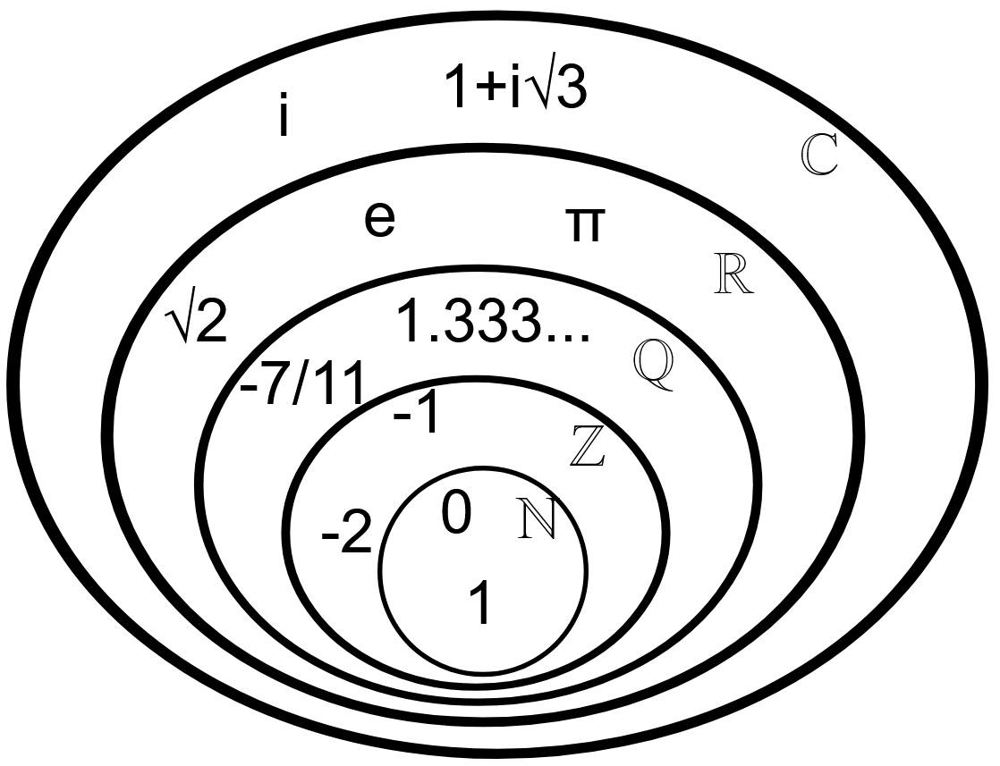

<!--prettier-ignore-start-->
# Numeric Representation 
{: .no_toc }

This module dives into the different types of numbers used in mathematics and how they relate to each other.

## Table of Contents
{: .no_toc .text-delta }  

1. TOC
{:toc}

<!--prettier-ignore-end-->

## A Family Tree of Numbers

Let's start by defining the different categories of numbers:

- **Natural Numbers**: Also known as the counting numbers, these are the positive integers starting at 1. ℕ = {1, 2, 3, 4, ...}
- **Whole Numbers:** The natural numbers, but including zero. 𝕎 = {0, 1, 2, 3, 4, ...}
- **Integers:** The whole numbers, but including all negative versions. ℤ = { ..., -3, -2, -1, 0, 1, 2, 3, ...}
- **Rational Numbers:** Any number that can be written as a _ratio_ of two numbers in the form p/q, where both p and q are natural numbers. **ℚ** is used represent the rationals.
- **Irrational Numbers**: Any number that cannot be expressed as the ratio of one over another. These numbers where their fractional component extends forever in a non-repeating sequence. ℝ-ℚ is sometimes used to represent the irrationals. Examples include [π](https://en.wikipedia.org/wiki/Pi) and the square root of 2.
- **Real Numbers:** Any number that can represent a distance on a number line. The reals (ℝ) include all integer, rational, and irrational numbers.
- **Imaginary Numbers:** Numbers that are the product of a real number and the imaginary unit _i_, where _i_ is defined to be the square root of -1.
- **Complex Numbers:** Number of the form a+b*i* where “a and b” are real numbers and “i” is the imaginary unit defined above. The set of all complex numbers is represented by ℂs.

## Visual Subsets of Numbers

🎵 Note:
{: .label .label-yellow}

Image combines the whole numbers (𝕎) with the natural numbers (ℕ).
{: .d-inline-block}

## Number Types Videos

<iframe width="560" height="315" src="https://www.youtube.com/embed/QUGmwPwtbpg" title="YouTube video player" frameborder="0" allow="accelerometer; autoplay; clipboard-write; encrypted-media; gyroscope; picture-in-picture" allowfullscreen></iframe>

A slightly different way of looking at this (without the inclusion of the imaginary numbers):

<iframe width="560" height="315" src="https://www.youtube.com/embed/5TkIe60y2GI" title="YouTube video player" frameborder="0" allow="accelerometer; autoplay; clipboard-write; encrypted-media; gyroscope; picture-in-picture" allowfullscreen></iframe>

## Further Reading

- [Type of Numbers @ Wikipedia](https://en.wikipedia.org/wiki/List_of_types_of_numbers)
- [Real, Irrational, Imaginary @ Mathigon](https://mathigon.org/world/Real_Irrational_Imaginary)
- [Video: The Map of Mathematics](https://www.youtube.com/watch?v=OmJ-4B-mS-Y)
