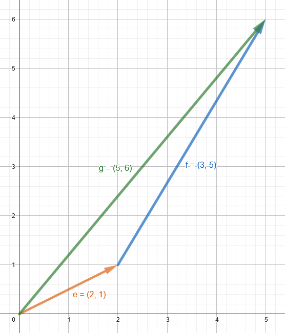
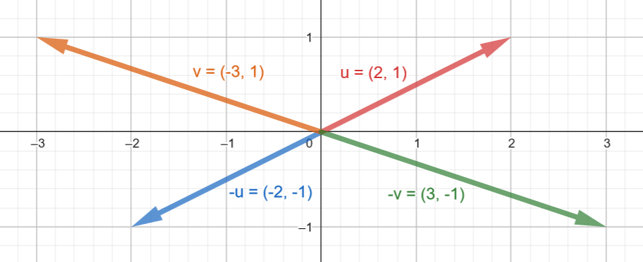

<!--prettier-ignore-start-->
# Vectors 
{: .no_toc }

A **vector** is a quantity fully described by its magnitude and its direction. 

## Table of Contents
{: .no_toc .text-delta }  

1. TOC
{:toc}

<!--prettier-ignore-end-->

## Objectives

By the end of this module you should be able to:

- Define a vector and differentiate it from a scalar value.
- Describe how vectors are used to define both a point in 2D space and a magnitude with direction.
- Calculate the result of 2D vector addition, subtraction, and multiplication.
- Calculate the length/magnitude of a given 2D vector.
- Calculate the normalized unit vector from a given 2D vector.
- Understand and apply the dot product to determine the angle between two vectors and their directional relationship.

## The Vector

The main building block for the math in this course is **the vector**, specifically the 2-dimensional vector.

In linear algebra, when we use the word vector we mean a **Euclidean Vector**, a mathematical entity that has both a magnitude and a direction.

## Scalars vs Vectors by Example

A **scalar** is a quantity fully described by its magnitude (or size).

Speed, for example, is a scalar. _I was traveling at 50km per hour._

The magnitude of my speed is 50km per hour.

A **vector** is a quantity fully described by both its magnitude and its direction.

Velocity, for example, is a vector. _I was traveling north at 50km per hour._

The magnitude of my velocity is 50km per hour and the direction of my velocity is north.

## Representing Vectors

Visually, you can think of a vector as points or arrows in space. In this course we'll be sticking to two dimensions (think height and width), so our vectors can be seen as points on a 2D Cartesian coordinate grid, or as arrows from one point to another on this grid.

Let's take the pair of numbers (5, 3). We can think of this as representing two things:

- The point on a 2D Cartesian grid 5 units to the right along the x-axis and 3 units up the y-axis.
- An arrow on this same grid, with the _tail_ of the arrow at the origin, and the _tip_ of the arrow at the point described above.

We're using the word "tail" here to mean the start of the vector, and the word "tip" to mean the end of the vector (the tip of the arrow).


🎵 Note:
{: .label .label-yellow}

The Cartesian grid is named after philosopher and mathematician [René Descartes](https://plato.stanford.edu/entries/descartes/).
{: .d-inline-block}

Descartes famously proposed that all truth begins with "cogito, ergo sum", or "I think, therefore I am".

## Vector Components

A vector is written as an ordered pair of **components**. A two-dimensional (2D) vector has two components.

```
Order pair of components: (x, y)
Example of a particular vector: (5, 3)
```

The first number in a 2D vector represents the vector's `x` component and the second number represents the vector's `y` component.

## Interactive 2D Vector Grid

Hover your mouse over this grid to explore a 2D Cartesian grid of floating point vectors.

<iframe src="https://editor.p5js.org/stungeye/embed/wFj8pPBGe" scrolling="no" frameborder="no"  width="400" height="442"></iframe>

🎵 Note: _If you're curious you can [check out how this was coded here](https://editor.p5js.org/stungeye/sketches/wFj8pPBGe)._'
{: .label .label-yellow}

## Vectors in Math Textbooks

In math textbooks you'll often see 2D vectors written in square braces, with the top number representing the x displacement and the bottom number representing the y displacement. You'll also see placeholders for vectors written as single letters with arrows above them.

So if we called our example vector (5,3) "c" it might be written in a textbook as:


When talking about vectors in this modules we won't be using this arrow notion, but it is used in [our textbook](https://natureofcode.com/).

## Vector Mathematics

Some common operations we'll be performing on vectors in this course:

- Addition - Adding two vectors together results in a new vector.
- Subtraction - Subtracting one vector from another results in a vector.
- Multiplication - We can scale the length of a vector by multiplying it by a scalar.
- Division - We can also scale the length of a vector by dividing it by a scalar.
- Calculating Magnitude - Determining the scalar length of a vector.
- Normalization - Scaling a vector to a length of 1 while preserving its direction.
- Normalized Dot Product - Used to determine if two vectors are facing in the same direction or not.

## Vector Addition

Adding two vectors together (regardless of the number of dimensions) is as simple as separately adding together their components.

Example:

```
vector e: (2, 1)
vector f: (3, 5)

vector g = e + f
vector g = (2 + 3, 1 + 5)
vector g = (5, 6)
```

## Visual Vector Addition

Adding vectors can also be performed visually on a 2D plane. We can add two vectors by drawing them "tip to tail", where tip means the tip of the arrow and tail means the start of the vector.

To visually add to vectors, we draw our first vector starting at the origin.

**Example: e = (2,1)**


Next, the second vector's "tail" (starting place) is drawn at the "tip" (end) of the first vector.

**Example: f = (3,5)**


The resulting visual sum can be seen by connecting the origin to the tip of the second vector.

**Example: g = e + f = (5, 6)**



## Properties of Vector Addition

Just like the addition of regular numbers, vector addition follows the commutative and associative rules:

**Cummutative Rule:** a + b = b + a

Regular Numbers Example:

`3 + 5 = 5 + 3 = 8`

Vector Example:

`(2, 1) + (3, 5) = (3, 5) + (2, 1) = (5, 6)`

**Associative Rule:** u + (v + w) = (u + v) + w

Regular Numbers Example:

(3 + 2) + 1 = 3 + (2 + 1) = 6

Vector Example:

`(2, 1) + ((3, 5) + (4, 4)) = ((2, 1) + (3, 5)) + (4, 4) = (9, 10) `

## Vector Negation

The negative of a vector is a vector of the same length in the opposite direction.

Numerically, this means that each component of the negated vector has its sign flipped.

Example:

```
 u = ( 2,  1)
-u = (-2, -1)
 v = (-3,  1)
-v = ( 3, -1)
```



## Vector Subtraction

To subtract one vector from another we simply add the first vector to a negated version of the second vector.

Example:

```
e = (2, 1)
f = (3, 5)

h = e - f
h = e + (-f)
h = (2, 1) + (-3, -5)
h = (2 + (-3), 1 + (-5))
h = (2 - 3, 1 - 5)
h = (-1, -4)
```

Visually, we are subtracting by drawing `e` and `-f` tip to tail.


## Vector Multiplication

Vector multiplication is a bit different from addition and subtraction in that we multiple vectors by scalars, not by other vectors. This is called **scaling** a vector.

Scaling a vector changes the vector's length, but doesn't alter the vectors direction.

Numerically, we scale a vector by multiply both components by the scalar value.

Example:

```
e = (2, 1)
h = 2 * e
h = 2 * (2, 1)
h = (2 * 2, 2 * 1)
h = (4, 2)
```

In the above example, the vector `h` is twice as long as the vector `e` after being scaled by a factor of 2.


## Vector Division

Vector division by a scalar is another way to alter a vector's length but not its direction.

Numerically, we scale a vector by dividing both components by the scalar value.

```
e = (3, 6)
h = e / 3
h = (3, 6) / 3
h = (3 / 3, 6 / 3)
h = (1, 2)
```

In the example above, the vector `h` is three times shorter than the vector `e`.

## Vector Magnitude with [Pythagoras](https://plato.stanford.edu/entries/pythagoras/)

Every vector can be thought of as the hypotenuse of a [right-angle triangle](/Applied-Math-For-Games-1/docs/07-game-dev-math/04-oscillation.html#the-right-triangle). Therefore, we can calculate the length of a vector by returning to high school math class and rediscovering the Pythagorean theorem.

If we have a vector (5, 3) then the length of the vector is:


```

c² = a² + b²
c = √(a² + b²)
c = √(5² + 3²)
c = √(25 + 9)
c = √34
c ≅ 5.83095189

```

⏳ Wait For It:
{: .label .label-blue}

We'll dig deeper into [the trigonometry of right triangles in our Oscillation module](/Applied-Math-For-Games-1/docs/07-game-dev-math/04-oscillation.html#the-right-triangle).
{: .d-inline-block}

## Vector Normalization

Vector normalization is the process of scaling a vector to have a length of 1, while maintaining its direction. This normalized vector is called a **unit vector**.

Normalizing a vector is often useful in computer games and physics simulations, when direction is important but magnitude is not.

To normalize a vector, we divide each component of the vector by its magnitude.

Example:

```
v = (3, 4)

|v| = magnitude of v
|v| = √(3² + 4²)
|v| = √(9 + 16)
|v| = √(25)
|v| = 5

normalized v = u
u = (3/5, 4/5)
u = (0.6, 0.8)
```

In the above example `u` is a unit vector that points in the same direction as `v`.

## Dot Product

The dot product (also known as the scalar product) is an important operation that takes two vectors and returns a single number (scalar). This number can tell us about the angle between the two vectors and whether they are pointing in the same direction.

For two 2D vectors `a=(ax,ay)` and `b=(bx,by)`, the dot product is calculated as follows:

`a ⋅ b = ax * bx + ay * by`

Example:

```
a = (1, 2)
b = (3, 4)

a ⋅ b = 1 * 3 + 2 * 4
a ⋅ b = 3 + 8
a ⋅ b = 11
```

### Geometric Interpretation

The dot product can also be calculated by using vector magnitudes and the cosine trigonometric function. 

```
a ⋅ b = ∣a∣ * ∣b∣ * cos(θ)
```

Where `∣a∣` and `∣b∣` are the magnitudes of `a` and `b`, respectivel, and θ is the angle between the two vectors. The cosine of θ (`cos(θ)`) can be determined with a calculator. Most programming languages also have functions for calculating this value. 

⏳ Wait For It:
{: .label .label-blue}

We'll dig deeper into [the trigonometry in our Oscillation module](/Applied-Math-For-Games-1/docs/07-game-dev-math/04-oscillation.html#the-right-triangle).
{: .d-inline-block}

## Using the Dot Product to Compare Vector Directions

The dot product of two vectors can be used to compare their directions by normalizing the vectors first. This involves calculating the dot product of their unit vectors.

The dot product helps determine if two vectors are pointing in the same direction, opposite directions, or somewhere in between.

### Steps to Compare Directions

- Normalize the Vectors: Convert each vector to its unit vector by dividing each component by the vector's magnitude.
- Calculate the Dot Product of the Unit Vectors: This will give a value between -1 and 1.

### Interpretation of the Result

- 1: The vectors are pointing in exactly the same direction.
- 0: The vectors are orthogonal (perpendicular) to each other.
- -1: The vectors are pointing in exactly opposite directions.
- Between 0 and 1: The vectors form an acute angle (less than 90 degrees).
- Between -1 and 0: The vectors form an obtuse angle (greater than 90 degrees).

## Summary

In this module, we've covered the fundamentals of 2D vectors, including their representation, basic operations like addition, subtraction, and scaling, as well as more advanced concepts like normalization and the dot product. Understanding these basics is crucial for applications in physics simulations, computer graphics, and many other fields in game development and beyond.
