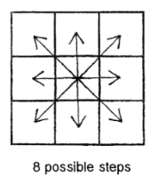
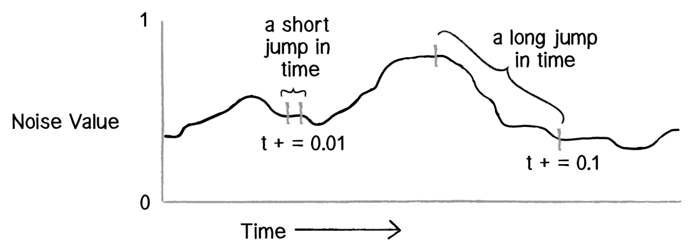
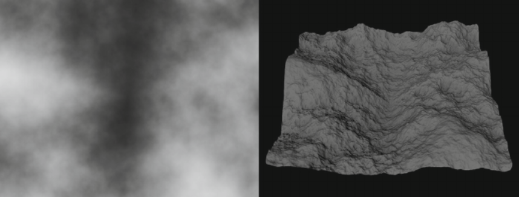
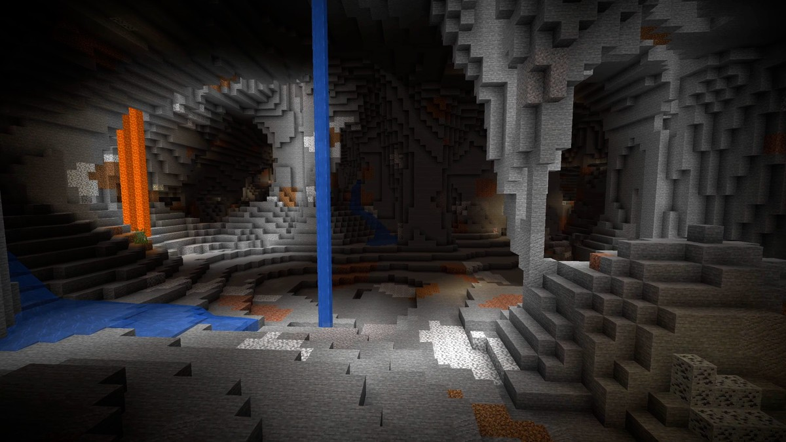
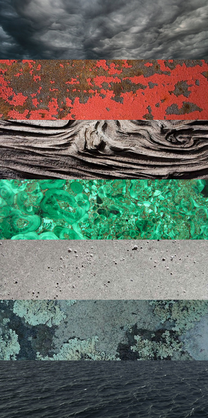

<!--prettier-ignore-start-->
# Randomness
{: .no_toc }

If something is unpredictable and doesn't seem to follow a recognizable pattern we call it **random**.

Randomness is a crucial element of lotteries, cryptography, simulations, games, and generative art.

## Table of Contents
{: .no_toc .text-delta }  

1. TOC
{:toc}

<!--prettier-ignore-end-->

## Module Topics

- Mean and Standard Deviation
- Probabilities and Distributions
- Pseudo-Random Numbers
- Random Walks

## Objectives

By the end of this module you should be able to:

- Describe how to calculate the probability of a single uniform event (coin toss, card selection).
- Differentiate between uniform and Gaussian probability distributions.
- Use p5js to generate uniform, gaussian, and Perlin random numbers.
- Implement a random walk simulation using p5js.
- Draw scenes using p5.js that make use of randomness and noise.

## Textbook Chapter

[Intro Chapter - Randomness - Nature of Code](/Applied-Math-For-Games-1/assets/pdf/noc_chp0_2021_draft.pdf) [pdf]

**Attribution:** The textbook for this course is Daniel Shiffman's Nature of Code. The Java Processing version of the book is [available online](https://natureofcode.com/book/). PDF of the p5js version linked above is [under development](https://github.com/nature-of-code/noc-book-2) and is licensed under the [Creative Commons Attribution-NonCommercial 3.0 Unported License](http://creativecommons.org/licenses/by-nc/3.0/).

## Computer Generated Random Numbers

Computers cannot generate true random numbers. This is because computer algorithms are deterministic; when given a specific input they always produce the same output. Because of this we call the random numbers that are generated by computers **pseudo-random**.

Sequences of pseudo-random numbers are predictable if you know the algorithm being used and the **seed** value used to start the sequence.

The **seed** is itself just a number. It's common to use the current time as a seed, since that means the sequence of pseudo-random numbers will be different each time we run the generator.

<iframe src="https://editor.p5js.org/stungeye/embed/J9k1jo_8z" scrolling="no" frameborder="no" width="50" height="50"></iframe>

☝️ _Click the above square to generate a new pseudo random number from 0 to 9._

[View / Edit the Code Using p5.js Web Editor](https://editor.p5js.org/stungeye/sketches/J9k1jo_8z)

## P5.js Random Numbers

P5.js includes a function for generating pseudo-random numbers called `random()`.

Without any arguments it returns a random floating point number from 0 up to (but not including) 1:

```javascript
let randomFloat = random(); // Some float from 0 up to (but not including) 1
```

If one numeric argument is given, it returns a number from 0 up to (but not including) the argument:

```javascript
let randomFloat = random(99); // Some float from 0 up to (but not including) 99
```

If two numeric arguments are given, it returns a number from the first argument up to (but not including) the second argument:

```javascript
let randomFloat = random(500, 510); // Some float from 500 up to (but not including) 510
```

Use `floor()` if you want random integers:

```javascript
let randomInteger = floor(random(4)); // 0, 1, 2, or 3 (but never 4)
let anotherRandomInteger = floor(random(10, 13)); // 10, 11, 12, (but never 13)
```

You can also pass an array as an argument pick a random element from that array:

```javascript
let shoppingList = ["goat", "oats", "boat", "coat"];
let randomWord = random(shoppingList);
```

To generate a predictable sequence of pseudo random numbers you can first set the seed:

```javascript
randomSeed(42);
let first = random(); // Always the same "random" number.
let second = random(); // Always the same "random" number.
let third = random(); // Always the same "random" number.
```

### Resources

- 📜 [`random()`](https://p5js.org/reference/#/p5/random) - The p5.js random number generator.
- 📜 [`randomSeed()`](https://p5js.org/reference/#/p5/randomSeed) - Used to re-seed the `random()` function.
- 📜 [`floor()`](https://p5js.org/reference/#/p5/floor) - Converts floats to integers by truncation.

## Random Walker

{: .small .inline }

In the following sketch a "walker" starts in the middle of the canvas. It then moves pseudo-randomly in one of eight possible equally weighted directions. If the walker's new location is white, it will be painted black. If the pixel is already shaded, it will be painted a lighter shade of grey.

<iframe src="https://editor.p5js.org/stungeye/embed/JN0sVjPmO" scrolling="no" frameborder="no" width="200" height="200"></iframe>

☝️ _Click the canvas to restart the sketch._

[View / Edit This Sketch Using p5.js Web Editor](https://editor.p5js.org/stungeye/sketches/JN0sVjPmO)

## Probabilities

The chance of an event occurring out of a set of possible outcomes is called a **probability**.

When we flip a coin there are two possible outcomes: Heads and Tails

Each outcome has a 50% chance of occurring, or a probability of 1/2 or 0.5.

When we roll a six-side die, there are six equally possible outcomes:

- Probability of a 1: 1/6
- Probability of a 2: 1/6
- Probability of a 3: 1/6
- etc.

In the above examples every outcome has an equal probability.

## P is for Probability

When talking about probabilities we can give a percentage like 50% or we can say that p=0.5.

When every outcome has an equal probability, like when rolling a die or flipping a coin, we calculate p like this:

``` 
p = 1 / (# of possible outcomes)
```

Example: The chance of rolling a 3 when rolling a six-sided die is `p = 1/6 = 0.166666...`

To convert a `p` calculation into a percentage we just need to multiply p by 100.

Example: The percentage chance of rolling a 3 when rolling a six-sided die is approximately 16.7%

## Grouped Probabilities

For certain events, the chance of the outcome isn't just 1 out of the possible number of outcomes.

When pulling a card from a deck of 52 play cards, the probability of pulling an ace is:

`p = number of aces / total numbers of cards = 4 / 52 = 0.077 = ~8%`

The probability of pulling a diamond is over three times greater:

`p = number of diamonds / number of cards = 13 / 52 = 0.25 = 25%`

When there's a group of outcomes that are equivalent we calcuate p like this:

```
p = (# of ways for a specific event to occur) / (# of total possible outcomes)
```

## Sequences of Probabilities

We can calculate the probability of a sequence of events by multiplying the individual probabilities.

The probability of a coin turning up heads three times in a row is:

`(1/2) * (1/2) * (1/2) = 1/8 = 0.125`

Anytime you flip a coin three times you have a 12.5% chance that all three flips will be heads.

## The Gambler's Fallacy

The probability of rolling only heads decreases as your number of flips increases. That said, the chance of rolling a head for each flip in a sequence is always 50%.

Let's say you flip heads 100 times in a row. There's still a 50% chance that the next flip will be a head, even though the probability of rolling 101 heads in a row is very small.

Thinking otherwise is called the **Gambler's Fallacy**, because gamblers often fool themselves into thinking that past random events will affect the outcome of future events.

## Randomness With Probabilities

Let's say you want to drop some loot with the following probabilities:

- 70% chance of: 🍄
- 20% chance of: 💰
- 10% chance of: 🗡️

To code this you might create an array where the items match their expected probabilities:

```javascript
let lootBag = ["🗡️", "💰", "💰", "🍄", "🍄", "🍄", "🍄", "🍄", "🍄", "🍄"];
let drop = random(lootBag);
```

But you could also use an if/else chain:

```javascript
let lootChance = random(); // Number from 0 up to (but not including) 1
let drop;

if (lootChance < 0.1) // (0 >= lootChance < 0.1) => 10% chance
  drop = "🗡️";
} else if (lootChance < 0.3) { // (0.1 >= lootChance < 0.3) => 20% chance
  drop = "💰";
} else { // (0.3 >= lootChance < 1.0) => 70% chance
  drop = "🍄";
}
```

<iframe src="https://editor.p5js.org/stungeye/embed/bNrdX70TE" scrolling="no" frameborder="no" width="400" height="100"></iframe>

☝️ _Click the canvas for another loot drop with the above stated probabilities._

[View / Edit the Code Using p5.js Web Editor](https://editor.p5js.org/stungeye/sketches/bNrdX70TE)

## Uniform vs Normal Distribution

The distribution of random numbers generated by the p5.js `random()` function is said to be uniform. By this we mean that there's an equal chance for any number in the range to be selected. In this way `random()` works just like rolling a die. 

There are, however, other types of distributions. 

Imagine for a moment the heights of all adult Manitobans. Everyone has a different height, so you could think about the heights of adult Manitobans as being random, but it's not a uniform random. When picking a Manitoban at random there's a higher probability of that person being 5.5 feet (168cm) tall than being 3ft (91cm) tall.

Height is an example of a "Normal" distribution, which is sometimes called a "Gaussian" distribution (named for mathematician Carl Friedrich Gauss). In a normal distribution the values cluster around an average, rather than being evenly distributed throughout a range.

## `random()` vs `gaussianRandom()`

In p5.js we can use the `gaussianRadom()` function to generate numbers with a normal distribution. 

When called without any arguments `gaussianRadom()` will return floating point numbers clustered around 0. The majority of these numbers will be between -1 and 1 but numbers further outside that range will also appear from time to time. 

When calling `gaussianRadom()` with two arguments:

* The first argument will be the average value that generated numbers will cluster around.
* The second argument will be average spread of the generated numbers around the first argument.

In the following sketch the x position of the red circles follows a uniform distribution while the blue circles follow a normal distribution.

```javascript
function draw() {
  // Fade away by clearing canvas with mostly transparent black.
  background(0, 5); 
  
  // Uniform random number in the range of 0 to 400.
  let randomX = random(0, 400);
  fill(200, 50, 50); // red-ish
  ellipse(randomX, 30, 16, 16);
  
  // Normal random number clustering around 200 with the majority
  // of generated values occuring in the 150 to 250 range.
  let gaussianX = randomGaussian(200, 50);
  fill(50, 50, 200); // blue-ish
  ellipse(gaussianX, 70, 16, 16);
}
```

<iframe src="https://preview.p5js.org/stungeye/embed/QRZkULbcp" scrolling="no" frameborder="no" width="50" height="50"></iframe>

[View / Edit the Code Using p5.js Web Editor](https://editor.p5js.org/stungeye/sketches/QRZkULbcp)

## Generating Noise

Sometimes we want to generate random numbers that have no relationship to previous numbers in the sequence. Other times it can be useful to generate random numbers that drift randomly and yet smoothly away from each other. One technique for generating "drifting" pseudo-random numbers is called Perlin Noise, which is named after its inventor Ken Perlin.

In the below sketch the x position of the circle on the left is controlled by Perlin noise, while the circle on the right is assign a random x position each frame.

<iframe src="https://editor.p5js.org/stungeye/embed/UxlTymprG" scrolling="no" frameborder="no" width="400" height="50"></iframe>

[View / Edit the Code Using p5.js Web Editor](https://editor.p5js.org/stungeye/sketches/UxlTymprG)

🎵 Note:
{: .label .label-yellow}

[Ken Perlin](https://cs.nyu.edu/~perlin/) won an Academy Award for his work on pseudo-random noise.
{: .d-inline-block}

## Noise in P5.js

The `noise()` function returns a value between 0 and 1 when given an offset. The offset represents "how far" the function should look into a "noise field". For 1-dimensional noise you can think of this field as a squiggly line.

We can increase the offset we pass to `noise()` to get new values, the smaller offset change the smoother the noise.



We can use the `map()` function to translate the 0 to 1 noise to large ranges. The function works like this:

`newValue = map(currentValue, currentMin, currentMax, newMin, newMax);`

The left circle in the previous sketch is controlled by code similar to:

```javascript
let offset = 0;

function draw() {
  let n = noise(offset);
  let x = map(n, 0, 1, 0, width);
  circle(x, 50, 20);
  t += 0.01;
}
```

## Resources

- 📜 [`noise()`](https://p5js.org/reference/#/p5/noise) - Perlin noise generator.
- 📜 [`noiseSeed()`](https://p5js.org/reference/#/p5/noiseSeed) - Re-seed the `noise()` function.
- 📜 [`noiseDetail()`](https://p5js.org/reference/#/p5/noiseDetail) - Adjusts the detail of noise generated by the `noise()` function.
- 📜 [`map`](https://p5js.org/reference/#/p5/map) - Maps a value from a range of values to a different range.

## Noisy Walkers

The following sketch includes two walkers:

- <span style="color: #2A9D8F;">Green Walker</span> uses `random()` to pick its next position.
- <span style="color: #E76F51;">Red Walker</span> uses `noise()` to pick its next position.

If you're colour blind, the <span style="color: #E76F51;">Red Perlin Walker</span>'s journey is the "smoother" of the two.

Investigate the sketch's source to see how I'm driving both the x and y position of the <span style="color: #E76F51;">Red Perlin Walker</span>.

<iframe src="https://editor.p5js.org/stungeye/embed/_AMr0dMHF" scrolling="no" frameborder="no" width="200" height="200"></iframe>

☝️ _Click the canvas to restart the sketch._

[View / Edit the Code Using p5.js Web Editor](https://editor.p5js.org/stungeye/sketches/_AMr0dMHF)

## Higher Dimensional Noise

So far we've only looked at 1-dimensional Perlin noise. We thought of 1D noise as sampling the height of a squiggly line at a particular offset. As such, we can use 1D noise to generate the outlines of waves and mountains.

{: .medium}

### 2D Noise

The `noise()` function can also generate 2D:

```javascript
let value1 = noise(offset1, offset2); // 2D noise
```

2D noise can be used to generate a cloudy texture, or it can be sampled to produce a height map for valley and mountain terrain generation.

{: .medium}

### 3D Noise

We can also generate 3D noise:

```javascript
let value2 = noise(offset1, offset2, offset3); // 3D noise
```

3D noise can be use to generate blobs, [planetary surfaces](https://www.youtube.com/watch?v=lctXaT9pxA0), or 3D terrains that include caves (think Minecraft voxel terrain).

{: .medium}

## Other Forms of Noise

There are other forms of procedural noise beyond Perlin noise:

- 📚 [Simplex Noise](https://en.wikipedia.org/wiki/Simplex_noise)
- 📚 [OpenSimplex Noise](https://en.wikipedia.org/wiki/OpenSimplex_noise)
- 📚 [Wavelet Noise](https://en.wikipedia.org/wiki/Wavelet_noise)
- 📚 [Value Noise](https://en.wikipedia.org/wiki/Value_noise)
- 📚 [Worley Noise](https://en.wikipedia.org/wiki/Worley_noise)

I find Worley noise to be of particular beauty:

{: .large }

## Natural Noise

Look around you. The natural world is full of beautiful noise and randomness!

{: .large}

☝️ _Click to embiggen._

## Further Reading

- 📚 [Understanding Perlin Noise](https://adrianb.io/2014/08/09/perlinnoise.html)
- 📚 [Understanding Randomness](https://www.baeldung.com/cs/randomness)
- 📚 [Advanced Randomness Techniques for Game AI](http://www.gameaipro.com/GameAIPro/GameAIPro_Chapter03_Advanced_Randomness_Techniques_for_Game_AI.pdf) (Free Chapter from [Game AI Pro](http://www.gameaipro.com/) Volume 1)
- 📚 [Notch Explains Early Minecraft Terrain Generation](https://notch.tumblr.com/post/3746989361/terrain-generation-part-1)
