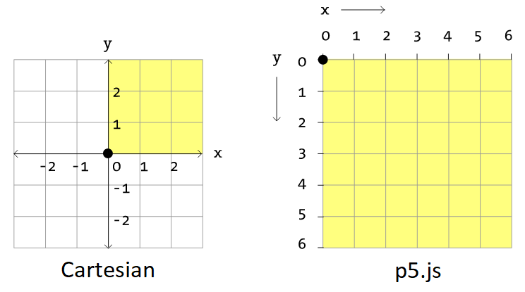
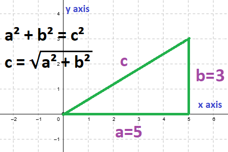

<!--prettier-ignore-start-->
# Vectors
{: .no_toc }

A **vector** is a quantity fully described by its magnitude and its direction.

Vectors are a powerful tool for modeling physical behaviour like motion and gravity.

## Table of Contents
{: .no_toc .text-delta }  

1. TOC
{:toc}

<!--prettier-ignore-end-->

## Objectives:

By the end of this module you should be able to:

- Define a vector and differentiate it from a scalar value.
- Describe how vectors are used to define both a point in 2D space and a magnitude with direction.
- Calculate the result of 2D vector addition, subtraction, and multiplication.
- Calculate the length/magnitude of a given 2D vector.
- Calculate the normalized unit vector from a given 2D vector.
- Use vectors to model simple linear acceleration and velocity in a p5js application.

## Textbook Chapter

[Chapter 1 - Vectors - Nature of Code](/Applied-Math-For-Games-1/assets/pdf/noc_chp1_2021_draft.pdf) [pdf]

**Attribution:** The textbook for this course is Daniel Shiffman's Nature of Code. The Java Processing version of the book is [available online](https://natureofcode.com/book/). PDF of the p5js version linked above is [under development](https://github.com/nature-of-code/noc-book-2) and is licensed under tbuhe [Creative Commons Attribution-NonCommercial 3.0 Unported License](http://creativecommons.org/licenses/by-nc/3.0/).

## The Vector

The main building block for the math in this course is **the vector**, specifically the 2-dimensional vector.

To start, it's important that we don't confuse the term with the use of the same word in C++. In C++ a vector is a dynamic storage container similar to an array. In linear algebra, however, when we use the word vector we mean a **Euclidean Vector**, a mathematical entity that has both a magnitude and a director.

## Scalars vs Vectors by Example

A **scalar** is a quantity fully described by its magnitude (or size).

Speed, for example, is a scalar. _I was travelling at 50km per hour._

The magnitude of my speed is 50km per hour.

A **vector** is a quantity fully described by both its magnitude and its direction.

Velocity, for example, is a vector. _I was travelling north at 50km per hour._

The magnitude of my velocity is 50km per hour and the direction of my velocity is north.

## Representing Vectors

Visually, you can think of a vector as points or arrows in space. In this course we'll be sticking to two dimensions, so our vectors can be seen as points on a 2D Cartesian coordinate grid, or as arrows from one point to another on this grid.

Let's take the pair of numbers (5, 3). We can think of this as representing two things:

- The point on a 2D Cartesian grid 5 units to the right along the x-axis and 3 units up the y-axis.
- An arrow on this same grid, with the _tail_ of the arrow at the origin, and the _tip_ of the arrow at the point described above.


🎵 Note:
{: .label .label-yellow}

The Cartesian grid is named after philosopher and mathematician [René Descartes](https://plato.stanford.edu/entries/descartes/).
{: .d-inline-block}

Descartes famously proposed that all truth begins with "cogito, ergo sum", or "I think, therefore I am".

## Vectors in Math Textbooks

I've written the above vector as the pair of number in parenthesis. In math textbooks you'll often see 2D vectors written in square braces, with the top number representing the x displacement and the bottom number representing the y displacement. You'll also see placeholders for vectors written as single letters with arrows above them.

So if we called the above example vector "c" it might be written in a textbook as:


## Interactive 2D Vector Grid

<iframe src="https://editor.p5js.org/stungeye/embed/wFj8pPBGe" scrolling="no" frameborder="no"  width="400" height="400"></iframe>

☝️ _Hover your mouse over this grid to explore vectors on a 2D cartesian grid. If you're curious you can [check out how this was coded here](https://editor.p5js.org/stungeye/sketches/wFj8pPBGe)._

## Vector Mathematics

Some common operations we'll be performing on vectors in this course:

- Addition - Adding two vectors together results in a new vector.
- Subtraction - Subtracting one vector from another results in a vector.
- Multiplication - We can scale the length of a vector by multiplying it by a scalar.
- Division - We can also scale the length of a vector by dividing it by a scalar.
- Calculating Magnitude - Determining the scalar length of a vector.
- Normalization - Scaling a vector to a length of 1 while preserving its direction.

[Our textbook does a great job of explaining these concepts](/Applied-Math-For-Games-1/assets/pdf/noc_chp1_2021_draft.pdf), so I won't repeat those explanations here.

## Vectors in p5.js

p5.js has a class called `p5.Vector` that we can use to represent vectors in our code. The x and y components of each vector are available as properties. Vectors are created using the `createVector()` function:

```javascript
let vector = createVector(40, 80);
ellipse(vector.x, vector.y, 50, 50);
```

We can also create random vectors using `p5.Vector.random2D()` or create vectors from angles and lengths using `p5.Vector.fromAngle()`. Here's a fun sketch that makes use of random vectors:

<iframe src="https://editor.p5js.org/stungeye/embed/FixFDvy12"  scrolling="no" frameborder="no"  width="250" height="250"></iframe>

[Edit Code Using p5.js Web Editor](https://editor.p5js.org/stungeye/sketches/FixFDvy12)

### Resources

- 📜 [`createVector()`](https://p5js.org/reference/#/p5.Vector/createVector) - Create new vector objects.
- 📜 [`random2D()`](https://p5js.org/reference/#/p5.Vector/random2D) - Make a new 2D unit vector from a random angle.
- 📜 [`fromAngle()`](https://p5js.org/reference/#/p5.Vector/fromAngle) - Create new 2D vector object from an angle.

## The Trouble with Y

⚡ Warning:
{: .label .label-red}

The positive direction of the p5.js y-axis is opposite of the Cartesian direction.
{: .d-inline-block}

- **p5.js:** The y value increases as you move _down_ the y-axis.
- **Cartesian:** The y value increases as you move _up_ the y-axis.

Also, with Cartesian coordinates the origin is in the center of the canvas, but with p5.js the origin is in the top left corner.



## Vector Addition in p5.js

2D vectors can be added together by summing their x and y components to make a new vector.

Manually this could be done as follows:

```javascript
// c = a + b
let a = createVector(40, 80);
let b = createVector(5, 10);
let c = createVector(a.x + b.x, a.y + c.y);
```

## Adding to an Existing Vector

Vector addition can be performed in p5.js by mutating an existing vector with the `.add()` method, or by creating a new vector using the static method `p5.Vector.add()`.

Here's an example of adding to an existing vector:

```javascript
let position;
let velocity;

function setup() {
  createCanvas(320, 150);
  position = createVector(0, 0);
  velocity = createVector(2.5, 5);
}

function draw() {
  background(235);

  // Add the velocity vector to the position:
  position.add(velocity);

  if (position.x > width || position.x < 0) {
    velocity.x = velocity.x * -1;
  }
  if (position.y > height || position.y < 0) {
    velocity.y = velocity.y * -1;
  }

  ellipse(position.x, position.y, 25, 25);
}
```

<iframe src="https://editor.p5js.org/stungeye/embed/C-rrqEgJm"  scrolling="no" frameborder="no"  width="320" height="150"></iframe>

### Resources

- 📜 [`.add()`](https://p5js.org/reference/#/p5.Vector/add) - Vector addition methods.

## Adding Two Vectors to Make a Third

Another way to think about vector addition is to place two vectors "tip to tail". The final position of this "journey" along the two vectors is their sum.

Here's a sketch demonstrating this idea that uses the static `p5.Vector.add()` method to add two vectors:

```javascript
function draw() {
  background(240);

  let origin = createVector(0, 0);
  let a = createVector(mouseX, mouseY);
  let b = createVector(-50, 40);

  // Create a new vector by adding a and b:
  let c = p5.Vector.add(a, b);

  drawArrow(origin, a, colorA);
  drawArrow(a, b, colorB);
  drawArrow(origin, c, colorC);

  drawText();
}
```

Not shown are the `setup()`, `drawText()`, and `drawArrow()` methods. [See the full code here](https://editor.p5js.org/stungeye/sketches/oN2-iJN_v).

<iframe src="https://editor.p5js.org/stungeye/embed/oN2-iJN_v" scrolling="no" frameborder="no"  width="200" height="200"></iframe>

### Resources

- 📜 [`p5.Vector.add()`](https://p5js.org/reference/#/p5.Vector/add) - Vector addition methods.

## Vector Subtraction in p5.js

2D vectors can be subtracted by manually subtracting their x and y components.

Like addition, we can more easily perform vector subtraction by mutating an existing vector with the `.sub()` method, or by creating a new vector using the static method `p5.Vector.sub()`.

### Resources

- 📜 [`.sub() & p5.Vector.sub()`](https://p5js.org/reference/#/p5.Vector/sub) - Vector addition methods.

## Vector Multiplication and Division

Vectors can be scaled in length by multiplying or dividing them by scalar values. A vector's direction in unaffected by these operations.

In p5.js like with addition/subtraction, multiplication/division of vectors can be done by mutating an existing vector using `.mult()` and `.div()`, or by creating new vectors using the static `p5.Vector.mult()` and `p5.Vector.div()` methods.

Here the blue vector is a scaled copy of the red one. The scale is controlled by the mouse's x position:

```javascript
let center = createVector(width / 2, height / 2);
let redVector = createVector(width / 5, -width / 5);
let scaleFactor = map(mouseX, 0, width, -2, 2, true);
let blueVector = p5.Vector.mult(redVector, scaleFactor);
```

<iframe src="https://editor.p5js.org/stungeye/embed/gVn52AVlw" scrolling="no" frameborder="no"  width="205" height="200"></iframe>

[Edit Full Code Using p5.js Web Editor](https://editor.p5js.org/stungeye/sketches/gVn52AVlw)

### Resources

- 📜 [`.mult() & p5.Vector.mult()`](https://p5js.org/reference/#/p5.Vector/mult) - Vector multiplication methods.
- 📜 [`.div() & p5.Vector.div()`](https://p5js.org/reference/#/p5.Vector/div) - Vector division methods.

## Vector Magnitude with [Pythagoras](https://plato.stanford.edu/entries/pythagoras/)

Every vector can be thought of as a the hypotenuse of a right-angle triangle. Therefore, we can calculate the length of a vector by returning to high school math class and rediscovering the Pythagorean theorem.

If we return to our example vector at (5, 2) then the length of the vector is:



```
c² =  a² + b²
c  =  √(a² + b²)
c  =  √(5² + 2²)
c  =  √(25 + 4)
c  =  √29
c  ≅  5.3851648
```

## Vector Magnitude with p5.js

With p5.js we can skip the high school math and use `.mag()` or `p5.Vector.mag()`:

```javascript
let origin = createVector(0, 0);
let vector = createVector(mouseX, mouseY);
let length = vector.mag().toFixed(2);
```

<iframe src="https://editor.p5js.org/stungeye/embed/zO1KyODtZ" scrolling="no" frameborder="no"  width="205" height="200"></iframe>

[Edit Full Code Using p5.js Web Editor](https://editor.p5js.org/stungeye/sketches/gVn52AVlw)

⚡ Warning:
{: .label .label-red}

Calculating magnitude is expensive due to the square root.
{: .d-inline-block}

You can get away with using the computationally cheaper `.magSq()` if don't care about the actual value and only want to compare vectors.

### Resources

- 📜 [`.mag() & p5.Vector.mag()`](https://p5js.org/reference/#/p5.Vector/mag) - Vector multiplication methods.
- 📜 [`.magSq() & p5.Vector.magSq()`](https://p5js.org/reference/#/p5.Vector/magSq) - Vector multiplication methods.

## Normalizing Vectors

A **unit vector** is a vector with a magnitude of exactly 1. **Normalization** is the process of converting a vector to a unit vector by dividing it by its magnitude.

In the following sketch we normalize a copy of the red vector and then multiply it by the circle radius to get the blue vector. The same thing could have been accomplished by setting the blue vector length to the circle radius using `.setMag()`:

```javascript
let radius = 50;
let origin = createVector(width / 2, height / 2);
let vectorRed = createVector(mouseX, mouseY).sub(origin);
let vectorBlue = p5.Vector.normalize(vectorRed).mult(radius);

// Alternatively we could create the blue vector like this:
// let vectorBlue = vectorRed.copy().setMag(radius);
```

<iframe src="https://editor.p5js.org/stungeye/embed/K7E6yJ-S_" scrolling="no" frameborder="no"  width="200" height="200"></iframe>

[Edit Full Code Using p5.js Web Editor](https://editor.p5js.org/stungeye/sketches/K7E6yJ-S_)

## Vector Equality

To check if two vectors are equal we have to use the `.equals()` method, rather than the `==` or `===` operator:

```javascript
let v1 = createVector(5, 10);
let v2 = createVector(5, 10);

// == and === will not work:
console.log(v1 == v2); // false
console.log(v1 === v2); // false

// .equals() is how we check equality:
console.log(v1.equals(v2)); // true
console.log(v1.equals(5, 10)); // true
```

## Simulating Motion with Vectors

Near the beginning of this module we saw a sketch that simulating a bouncing ball. Two vectors were used, one to represent the position of the ball, and another to represent its velocity.

This is the basis for simulated physical motion:

1. Add velocity to position.
2. Update position or velocity if necessary. (Example: Wall bounce or canvas wrap)
3. Draw object at position.
4. Repeat.

In the case of the bouncing ball the code looked like this:

```javascript
// 1. Add velocity to position.
position.add(velocity);

// 2. Update the velocity if necessary.
if (position.x > width || position.x < 0) {
  velocity.x = velocity.x * -1;
}
if (position.y > height || position.y < 0) {
  velocity.y = velocity.y * -1;
}

// 3. Draw object at position.
ellipse(position.x, position.y, 25, 25);

// 4. Repeat (The above code goes inside the draw() function.)
```

[Click here to see the bouncing ball example refactored as a class](https://editor.p5js.org/stungeye/sketches/bBwlVlyo_).

## Extending Motion Simulation with Acceleration

If velocity is the _rate of change_ of position, then acceleration is the _rate of change_ of velocity.

With acceleration added our steps for simulation physical motion become:

1. Calculate current acceleration.
2. Add acceleration to velocity.
3. Limit velocity to a maximum speed. (Example: Vehicle's max speed)
4. Add velocity to to position.
5. Update position or velocity. (Example: Wall bounce or canvas wrap)
6. Draw object at position.
7. Repeat.

Acceleration can be calculated in all sorts of ways. For example:

- Acceleration towards a goal.
- Random or noise-based acceleration. (The return of the random walker!)
- Acceleration due to gravity. (local scale: 9.8m/s down)
- Acceleration due to gravity. (solar system scale: sum of attractive celestial bodies)

Here's a sketch of the first type, where our "mover" accelerates towards the mouse pointer:

```javascript
function draw() {
  background(250);
  mover.update(); // Update position from velocity.
  mover.checkEdges(); // Edge bounce.
  mover.display(); // Display as ball. Click canvas for "nose".
}

class Mover {
  constructor(startingPosition, startingVelocity, speedLimit, size) {
    this.position = startingPosition;
    this.velocity = startingVelocity;
    this.speedLimit = speedLimit;
    this.size = size;
  }

  // Add the mover's velocity to its position.
  update() {
    // Calculate the distance (delta) to the mouse.
    let mouse = createVector(mouseX, mouseY);
    let delta = p5.Vector.sub(mouse, this.position);

    // Scale the directional delta to a magnitude from 0 to 0.5.
    delta.normalize().mult(0.5);
    this.acceleration = delta;

    // Acceleration changes the mover's velocity.
    this.velocity.add(this.acceleration);

    // Mover has a maximum speed.
    this.velocity.limit(this.speedLimit);

    // Velocity changes the mover's position.
    this.position.add(this.velocity);
  }

  // Display the mover as circle at its current position.
  // Hit any key to see a "nose" visualizing the current velocity.
  display() {
    // See full source code linked below.
  }

  // Implements an "edge bounce".
  checkEdges() {
    // See full source code linked below
  }
}
```

[Edit Full Code Using p5.js Web Editor](https://editor.p5js.org/stungeye/sketches/M5Ac9dFHA)

<iframe src="https://editor.p5js.org/stungeye/embed/M5Ac9dFHA" scrolling="no" frameborder="no"  width="400" height="400"></iframe>

☝️ _Ball will accelerate towards mouse pointer. Click to increase number of movers from 1 to 10._

## Vectors in Physics, Math, and Computer Science (10 Minute Video)

<iframe width="560" height="315" src="https://www.youtube.com/embed/fNk_zzaMoSs" title="YouTube video player" frameborder="0" allow="accelerometer; autoplay; clipboard-write; encrypted-media; gyroscope; picture-in-picture" allowfullscreen></iframe>
