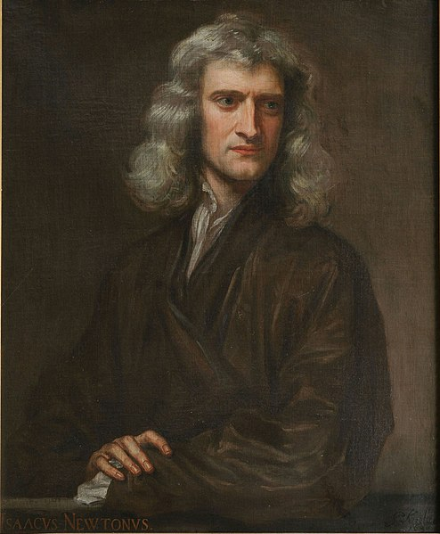
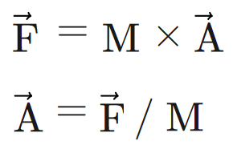

<!--prettier-ignore-start-->
# Forces and Newtonian Physics 
{: .no_toc }

A **force** is a vector representing a push or a pull that causes an object to accelerate.

Issac Newton developed three laws to describe the motion of objects subject to forces.

## Table of Contents
{: .no_toc .text-delta }  

1. TOC
{:toc}

<!--prettier-ignore-end-->

## Objectives:

By the end of this module you should be able to:

- Describe Newton’s three laws of motion.
- Explain the difference between weight and mass.
- Using p5.js to implement Newton’s second law as code and use it to simulate the forces of gravity, friction, and drag.

## Textbook Chapter

[Chapter 2 - Forces - Nature of Code](/Applied-Math-For-Games-1/assets/pdf/noc_chp2_2020_draft.pdf) [pdf]

**Attribution:** The textbook for this course is Daniel Shiffman's Nature of Code. The Java Processing version of the book is [available online](https://natureofcode.com/book/). PDF of the p5js version linked above is [under development](https://github.com/nature-of-code/noc-book-2) and is licensed under tbuhe [Creative Commons Attribution-NonCommercial 3.0 Unported License](http://creativecommons.org/licenses/by-nc/3.0/).

## Exploring Physics in Code

{: .inline .small}

Let's build a simple physics engine!

We use our new knowledge of vectors, combined with the [Three Laws of Motion](https://en.wikipedia.org/wiki/Newton%27s_laws_of_motion) first described by [Issac Newton](https://en.wikipedia.org/wiki/Isaac_Newton) in the 1680s.

## Newton’s Laws of Motion

**Netwon's three laws** are the foundation of classical mechanics, the part of physics that describes the movement of objects in the world.

In short, the three law's are:

- An object at rest stays at rest and an object in motion stays in motion.
- Force equals mass times acceleration.
- For every action there is an equal and opposite reaction.

## Forces

A **force** is a vector representing a push or a pull that causes an object with mass to accelerate.

There are **contact forces** like friction and tension.

There are also **action-at-a-distance** forces like gravity and magnetism.

Forces are measured in a unit known as a **Newton (N)**. One Newton is the amount of force needed to apply 1 m/s² of acceleration to a 1kg object. Force is a vector, so the applied acceleration of a Newton has both a magnitude and a direction.

## Newton's First Law - Inertia

_An object at rest stays at rest, and an object in motion stays in motion at a constant speed and direction, unless acted upon by an unbalanced force._

This is **the law of inertia**, first formulated and refined by [Galileo Galilei](https://en.wikipedia.org/wiki/Galileo_Galilei) and [René Descartes](https://en.wikipedia.org/wiki/Ren%C3%A9_Descartes).

It might seem weird to think of moving objects remaining forever at a constant speed. If you roll a ball it eventually stops, but that's because the forces of friction and air resistance slow it down.

Thinking in vectors, we might restate the law as:

_An object's velocity remains constant until an unbalance force changes its acceleration._

The force must be unbalance, because balanced forces will cancel each other out. For example, a one Newton force applied due East to an object will be cancelled out by an equal force applied due West.

## Newton's Second Law - Force

**Force equals mass times acceleration.**

This law quantifies the changes a force can produce on the motion of an object. If we take an object in motion, we can say that this object has a _momentum_ equal to its velocity times its mass. An object's momentum is a vector with the same direction as its velocity. A force applied to an object can change its the direction or magnitude of its momentum.

Mathematically the second law look like this:



From this we can see that:

- Acceleration is directly proportion to force: The harder you are pushed, the faster you'll accelerate.
- Acceleration is inversely proportion to mass: The heavier you are, the slower you'll move.

## Newton's Third Law - Action & Reaction

_For every action there is an equal and opposite reaction._

In other words, forces always occur in pairs. When two objects interact, they apply forces to each other that are equal is magnitude and opposite in direction.

In terms of vectors, these paired forces could be labeled `f1` and `f2` where `f2 = -f1`.

For simplicity we'll play fast and loose with this law, sometimes only modelling one of the forces in any given pair. For example, when adding wind to a simulation we might add the force of the wind to the objects in the scene, but we'll ignore the equal force exerted by objects back on the air.

## Weight vs Mass

Note that the second law mentions mass, not weight. There's a technical difference between these two quantities that we gloss over in everyday life.

- The **mass** of an object is the amount of matter in an object, measured in Kilograms.
- The **weight** of an object is the force of gravity on an object, measured in Newtons.

From the 2nd law, if weight is the force of gravity:

```
F = m * A
Weight = mass * Gravity
```

A cannonball has the same mass on earth as on the moon, but due to the decrease in gravity, it weighs less on the moon.

## Newton’s Laws as Code

Starting with a simple `Mover` class:

```javascript
class Mover {
  constructor(position, velocity, mass) {
    this.position = position;
    this.velocity = velocity;
    this.acceleration = createVector();
    this.mass = mass;
  }
}
```

The first law tells us that if we want to change the `Mover`s velocity we need to apply a force.

Let's add an `applyForce()` method to the `Mover` class based on the second law:

```javascript
applyForce(force) {
    this.acceleration = p5.Vector.div(force, this.mass);
}
```

In order to allow multiple forces to act of a `Mover` we need the forces to accumulate:

```javascript
applyForce(force) {
    let scaledForce = p5.Vector.div(force, this.mass);
    this.acceleration.add(scaledForce);
}
```

We can now change a `Mover`'s velocity like this, assuming we have `wind` and `gravity` vectors:

```javascript
mover.applyForce(wind);
mover.applyForce(gravity);
mover.update();
```

We also need to reset acceleration to zero on every `update()` otherwise old forces will continue to have an affect:

```javascript
update() {
    this.velocity.add(this.acceleration);
    this.position.add(this.velocity);
    this.acceleration.set(0, 0);
}
```

## Wind and Friction

As seen above we can simulate wind simply by apply a small force in a specific direction.

For friction we will use an idealized version of the static friction formula:

```
F = -1 * μ * N * v̂
```

- μ (mu) is called the coefficient of friction. The smaller the number, the less friction.
- N is the Normal Force of gravity times mass. For now we'll only consider horizontal surfaces.
- v̂ is the velocity of the moving object.
- The -1 indicates that friction works in the opposite direction of the object's velocity.

If we ignore mass we can get away with a simple scaling of the velocity:

```javascript
friction() {
  // Scale velocity to 95% regardless of mass.
  this.velocity.mult(0.95);
}
```

Implementing the friction formula isn't too tricky:

```javascript
friction() {
   // Direction of friction
    let friction = this.velocity.copy().normalize().mult(-1);

    // Magnitude of Friction
    let normal = this.mass; // Simplified by ignoring gravity constant.
    friction.setMag(this.mu * normal);

    // Apply the friction force to the mover.
    this.applyForce(friction);
}
```

## Wind and Friction Simulation

Here's a simulation with idealized wind and friction. Imagine you are looking "top down" at a pool table or a golf green. The size of the object scales with its mass. Apply wind by clicking. Hit any key to randomize object sizes. For simplicity objects do not interact with each other.

<iframe src="https://preview.p5js.org/stungeye/embed/mUxsWj-nw" scrolling="no" frameborder="no"  width="400" height="442"></iframe>

[Edit Code Using p5.js Web Editor](https://editor.p5js.org/stungeye/sketches/mUxsWj-nw)

## Adding Gravity

Here's another simulation, but this time with gravity added as constant downwards force. Imagine this time that the bottom of the canvas is the ground. You can still add wind by clicking, and hitting any key restarts the simulation with newly randomized objects.

🎵 Note:
{: .label .label-yellow}

Friction is now serving two different purposes in this simulation:
{: .d-inline-block}

1. Horizontal ground friction.
2. Loss of energy on bounce, like would happen in real life due to momentum lost to sound and heat.

<iframe src="https://preview.p5js.org/stungeye/embed/jKlxa8ud5" scrolling="no" frameborder="no"  width="400" height="442"></iframe>

[Edit Code Using p5.js Web Editor](https://editor.p5js.org/stungeye/sketches/jKlxa8ud5)
