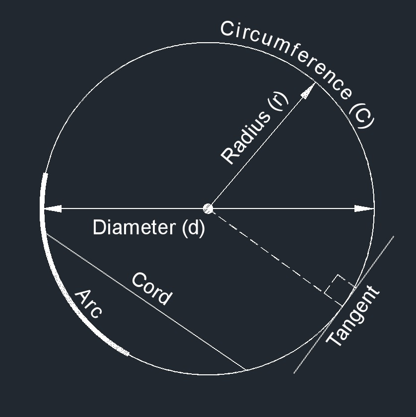
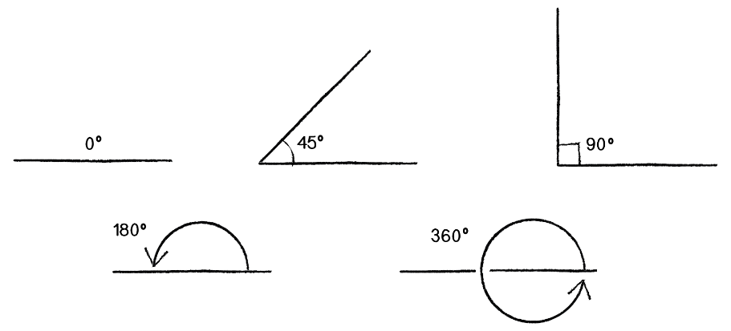
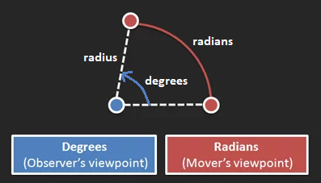
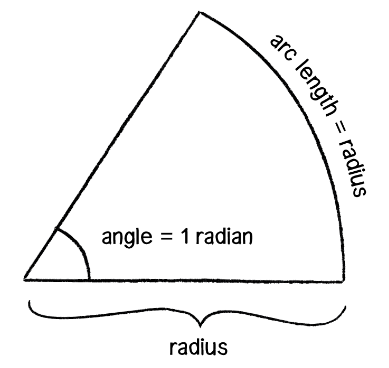
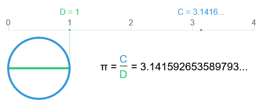
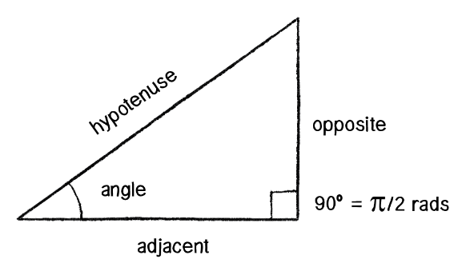
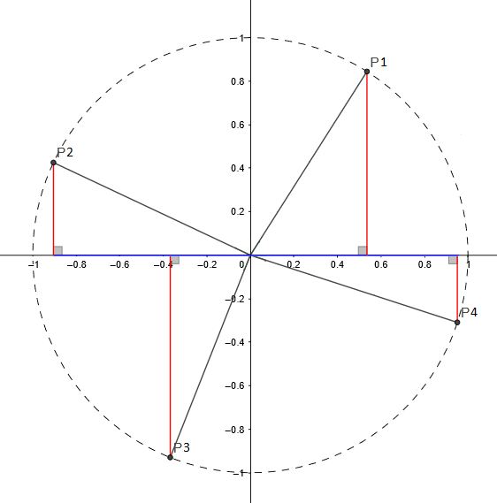
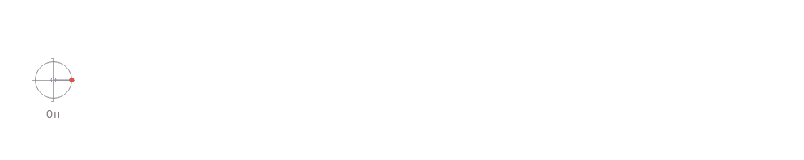
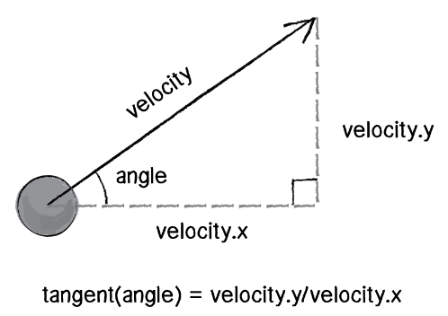
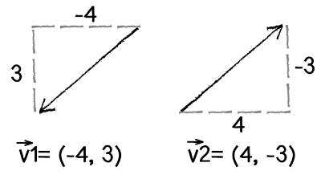

<!--prettier-ignore-start-->
# Trigonometry
{: .no_toc }

Trigonometry is the mathematics of right-angle triangles and circles. We can use trig to simulate angular motion and waves. It can also be used to convert between different coordinate systems. 

## Table of Contents
{: .no_toc .text-delta }  

1. TOC
{:toc}

<!--prettier-ignore-end-->

## Objectives

By the end of this module you should be able to:

- Differentiate between radians and degrees for the measurement of angles.
- Use trigonometric functions to determine the missing lengths / angles of a right angle triangle.
- Differentiate between polar and cartesian coordinates.
- Use sin and cos to convert between polar and cartesian coordinates.
- Draw waves of varying complexity using sin within a p5js sketch.

## Textbook Chapter

[Chapter 3 - Oscillation - Nature of Code](/Applied-Math-For-Games-1/assets/pdf/noc_chp3_2020_draft.pdf) [pdf]

**Attribution:** The textbook for this course is Daniel Shiffman's Nature of Code. The Java Processing version of the book is [available online](https://natureofcode.com/book/). PDF of the p5js version linked above is [under development](https://github.com/nature-of-code/noc-book-2) and is licensed under tbuhe [Creative Commons Attribution-NonCommercial 3.0 Unported License](http://creativecommons.org/licenses/by-nc/3.0/).

## Oscillation

{:class .medium .inline}

In physics, **oscillation** is defined as regular variation in magnitude or position **around a central point**.

Understanding oscillation will allow us to simulate physical systems such as:

- The swing of a pendulum.
- The motion of a wave.
- The bounce of a spring.
- The orbit of a planet.
- The vibration of a guitar string.

But before we can get to oscillation, we need to review the mathematics of trigonometry.

## Circular Logic

{:class .medium .inline}

When talking about systems that involve **a central point**, we'll undoubtedly reference circles, so let's start there.

From [Simple English Wikipedia](https://simple.wikipedia.org/wiki/Circle):

A **circle** is a round, two-dimensional shape. All points on the edge of the circle are the same distance from the center.

The **radius** of a circle is a line from the centre of the circle to a point on the side. We'll often use the letter `r` for the length of a circle's radius.

A **chord** is a line segment whose endpoints lie on the circle.

The **diameter** of a circle is the chord that goes through the centre of the circle. We'll use the letter `d` for the length of this line.

The **circumference** of a circle is the line that goes around the centre of the circle. We'll use the letter `C` for the length of this line, and we'll call a portion of the circumference an **arc**.

A **tangent** is a line that only shares a single point with a circle. Tangent lines are perpendicular (form a 90° angle with) a circle's radius.

## Angles (Degrees)

Circular rotation can be measured using an **angle** that can range from 0 to 360 degrees.



A quarter rotation is 90 degrees, and is said to be a **right angle**. A half rotation is 180 degrees and a full rotation is 360 degrees.

We use the ° symbol to indicate that a value is measured in degrees. Example: A right angle is 90°.

## Why 360 Degrees?

The number 360 is arbitrary; we can segment a circle into as many arcs as we wish. [The gradian unit](https://en.wikipedia.org/wiki/Gradian), for example, divides a circle into 400 equal gons.

[A theory](https://betterexplained.com/articles/intuitive-guide-to-angles-degrees-and-radians/) on why there are 360 degrees:

- Humans noticed that star constellations moved in a full circle every year.
- Every day, they were off by a tiny bit (“a degree”).
- Since a year has about 360 days, a circle had 360 degrees.

360 is a nicer to work with number than 365.242199, the actual numbers of days in a year, especially since it has many whole number divisors.

A few of 360's 20+ divisors: 2, 3, 4, 5, 6, 8, 9, 10, 15, 20, 30, 40, 45, 60, 90, 120, 180.

## Angles (Radians)

{:class .medium .inline}

Degrees measure segments of a circle from an observer's point of view as degrees of rotation, but there are other ways to measure these segments.

Imagine standing in the middle of a circular track watching a runner.

As the observer, you can measure the runner's movement by how far (in degrees) you turned your head to watch the run, but this measurement means little to the runner. From their point of view, they've run a particular distance.

This is the basis for **Radians**, which reframes rotation as **distanced traveled around a circle**.

## Radians Related to Radius

{:class .medium .inline}

The distance of an arc around a circle depends on the size of the circle, so radians are measured in terms of a circle's radius.

Specifically a radian is the ratio of a circle's arc to its radius. 1 radian is the angle at which this ratio equals 1.

In other words, a rotation of 1 radian occurs when the distance traveled around a circle is equal to its radius.

Angles measured in radians are said to be **rads**. For example: 180° = π rads

## A Slice of π

This is where pi (π) comes into the picture.

Pi is an [irrational number](/Applied-Math-For-Games-1/docs/06-numbers/01-number-family-tree.html) with the approximate value of `3.1415926535...`

Pi is _baked_ into radian measurements:

- A full circular rotation (360 degress) is 2 \* π radians.
- A half circle (180 degrees) is π radians.
- A quarter circle (90 degrees) is π/2 radians.

🎵 Note:
{: .label .label-yellow}

[But what about Tau](https://www.youtube.com/watch?v=jG7vhMMXagQ)?!
{: .d-inline-block}

## But What is PI?

Pi is defined as the ratio of a circle's circumference to its diameter.

You've likely seen it written in these forms:

```text
π = C / d
C = π * d
C = 2 * π * r
```

A circle with a diameter of 1 will have circumference of length pi.


Visualized another way:



⏳ Wait For It:
{: .label .label-blue}

Pi crops up throughout math and physics. We'll soon see how it relates to trigonometry.
{: .d-inline-block}

## Why Radians

Measuring rotation in radians can simplify our thinking. Here's an example from [betterexplained.com](https://betterexplained.com/articles/intuitive-guide-to-angles-degrees-and-radians/):

Imagine a monster truck with wheels that have a 2 meter radius.

If we know how fast the wheels are turning, how do we calculate the speed of the truck?

### Using Degrees

Let's say the wheels are turning 1080 degrees per second:

- That's `1080 / 360 = 3` rotations per second.
- Therefore the distance travelled per second will be three times the circumference of the wheels.
- `C = 2 * π * r = 2 * π * 2 = 4 * π`
- So the speed is `3 * C = 12 * π` meters per second.
- Which is????

### Using Radians

Next we're told the truck is moving at a different speed with the wheels turning 5 radians per second:

- For each radian the distance travelled is one radius (2 meters).
- At 5 radians per second the truck travels 2 meters 5 times, or 10 meters per second.

Much easier to think about and no pesky π.

### Resources

- 📚 [Intuitive Guide to Angles, Degrees and Radians @ Better Explained](https://betterexplained.com/articles/intuitive-guide-to-angles-degrees-and-radians/)
- 📚 [Prehistoric Calculus: Discovering Pi @ Better Explained](https://betterexplained.com/articles/prehistoric-calculus-discovering-pi/)
- 📚 [The Tau Manifesto by Michael Hartl](https://tauday.com/tau-manifesto)

## Processing Angles

p5.js has a number of helper functions and constants that will come in handing when working with angles:

- 📜 [`angleMode()`](https://p5js.org/reference/#/p5/) - Switch between radians (default) and degrees.
- 📜 [p5.Vector's `heading()`](https://p5js.org/reference/#/p5.Vector/heading) - Returns the angle of a vector.
- 📜 [`PI, TWO_PI, HALF_PI, QUARTER_PI, TAU`](https://p5js.org/reference/#group-Constants) - Handy constants for these irrational numbers.
- 📜 [`radians()`](https://p5js.org/reference/#/p5/radians) - Converts degrees to radians.
- 📜 [`degrees()`](https://p5js.org/reference/#/p5/degrees) - Converts radians to degrees.
- 📚 [`translate()` & `rotate()`](/Applied-Math-For-Games-1/docs/04-introduction-to-processing/02-drawing-shapes.html#translation-rotation-and-scaling) - Rotate the drawing canvas around a point.

## Angular Motion

Let's use `translate()` & `rotate()` to rotate rectangle using p5.js:

```javascript
let angle = 0; // Angle of the spinner.

function draw() {
  // Clear the canvas purple.
  background(146, 83, 161);

  // Draw rectangle rotated by current angle around canvas centre.
  translate(width / 2, height / 2);
  rotate(angle);
  rect(0, 0, width * 0.8, height * 0.1);

  // Increment the radian angle.
  angle += 0.01;
}
```

<iframe src="https://preview.p5js.org/stungeye/embed/1GLIrmVZD" scrolling="no" frameborder="no"  width="200" height="245"></iframe>

[Edit Code Using p5.js Web Editor](https://editor.p5js.org/stungeye/sketches/1GLIrmVZD)

## Angular Acceleration and Velocity

We can apply our knowledge of Newton's laws from the previous module to modify the angular motion using velocity, with acceleration based on mouse position:

```javascript
// Determine acceleration based on mouse position.
angularAcceleration = map(mouseX, 0, width, -0.01, 0.01);

// Forces 101: Acceleration changes veleocity.
angularVelocity += angularAcceleration;
angularVelocity = constrain(angularVelocity, -0.2, 0.2);

// Forces 101: Velocity changes angular rotation.
angle += angularVelocity;
```

Hover your mouse over the canvas. Angular acceleration is determined by the mouse's x position.

<iframe src="https://preview.p5js.org/stungeye/embed/j0jaVV_gj" scrolling="no" frameborder="no"  width="200" height="245"></iframe>

[Edit Code Using p5.js Web Editor](https://editor.p5js.org/stungeye/sketches/j0jaVV_gj)

## Spin It!

We could also simplify the user interaction using only velocity to let the user click and spin the rectangle:

```javascript
// Save the angle from the previous frame.
previousAngle = angle;

if (mouseIsPressed) {
  // Have spinner rotate using the mouse's heading.
  angle = createVector(mouseX - width / 2, mouseY - height / 2).heading();
  // Base spinner velocity on distance rotated since previous frame.
  // Bug here if angle crosses -PI and PI, where delta becomes a sum.
  angularVelocity = angle - previousAngle;
} else {
  // Apply the current velocity to the angle.
  angle += angularVelocity;
  // Simple linear friction.
  angularVelocity *= 0.98;
}
```

Click, drag, and release to spin the rectangle:

<iframe src="https://preview.p5js.org/stungeye/embed/ccrzVE85u" scrolling="no" frameborder="no"  width="200" height="245"></iframe>

[Edit Code Using p5.js Web Editor](https://editor.p5js.org/stungeye/sketches/ccrzVE85u)

## Noisy Rotation

Physical motion aside, knowledge of translation and rotation in p5.js can lead to some amazing results.

In this sketch by [Gene Kogan](https://twitter.com/genekogan) our old friend [Perlin Noise](/Applied-Math-For-Games-1/docs/07-game-dev-math/01-randomness.html#generating-noise) is used here to control the inner and outer rotations, translations, and square sizes.

<iframe src="https://preview.p5js.org/stungeye/embed/1eKtSVITv" scrolling="no" frameborder="no"  width="400" height="445"></iframe>

[Edit Code Using p5.js Web Editor](https://editor.p5js.org/stungeye/sketches/1eKtSVITv)

🎵 Note:
{: .label .label-yellow}

The code also makes clever use of nested rotation and translation using [push and pop](/Applied-Math-For-Games-1/docs/04-introduction-to-processing/02-drawing-shapes.html#translation-rotation-and-scaling).
{: .d-inline-block}

## Trigonometry

In the [Spin It! sketch](#spin-it) we used the `.heading()` method to get an angle from vector, but how exactly was that done "under the hood"?

The secret lies in trigonometry, the branch of mathematics that studies relationships between side lengths and angles of triangles.

Trigonometry also reveals the hidden concepts that relate circles to triangles.

We can use trigonometry to:

- Determine the rotation of a vector.
- Find the angle two given points. (Think simple AI steering and aiming.)
- Find the distance between two points. (Think simple collision detection.)
- Simulate physical systems that involve harmonic motion (waves, pendulums, springs).

⏳ Wait For It:
{: .label .label-blue}

The `heading()` secret mention above will be [revealed below](#drawing-vectors-using-trig).
{: .d-inline-block}

## The Right Triangle

{:class .inline .small}

A **triangle** is a 2D shape that has three sides and three angles that add up to 180 degrees (π radians).

A **right triangle** (right-angled or orthogonal triangle) has one angle that is 90 degrees (π/2 radians). The other two angles always add up to 90 degrees but can be different sizes.

## Which Side Are You On?

The **hypotenuse** is the longest side of a right triangle. It is always across from the right angle.

The other two sides are the **legs**, and are named in relation to one of the non-right angles.

Given one of the non-right angles, each leg will be either **opposite** that angle, or **adjacent** to it.

### Resources

The above definitions were sources from:

- 📚 [Right Triangle @ English Wikipedia](https://en.wikipedia.org/wiki/Right_triangle)
- 📚 [Triangle @ Simple English Wikipedia](https://simple.wikipedia.org/wiki/Right_triangle)

## SOH CAH TOA - Right Triangle Sides and Angles

Using the Pythagorean theorem (`a² + b² = c²`) we can determine the length of any side of a right triangle when given the other two sides.

The trigonometry functions **sine**, **cosine**, and **tangent** give us ways to determine the length of sides and angles of a right triangle.

- Sine: `sin = opposite / hypotenuse`
- Cosine: `cos = adjacent / hypotenuse`
- Tangent: `tan = opposite / adjacent`

Some people remember these relationships using the catch phrase: SOH CAH TOA

### Resources

- 📚 [Magnitude wit
  h Pythagoras in our Vector Modules](/Applied-Math-For-Games-1/docs/07-game-dev-math/02-vectors.html#vector-magnitude-with-pythagoras).

## The Triangle and The Circle

Let's return to the circle for a moment.

Any point along a circle's circumference also describes a right triangle attached to the origin.

{:class .large}

Each of those points can be described by either:

- An x and y coordinate.
- The angle within a right triangle. (Where the hypotenuse is the circle's radius.)

## Trig and the The Circle

This means that trig can be used to relate circle points at specific angles to x and y coordinates!

When given a point at a specific angle along the circumference of a circle...

We can find the y coordinate using sin:

```text
sin(angle) = opposite / hypotenuse
sin(angle) = y-coordinate / radius
y-coord = radius * sin(angle)
```

We can find the x coordinate using cos:

```text
cos(angle) = adjacent / hypotenuse
cos(angle) = x-coordinate / radius
x-coord = radius * cos(angle)
```

## Visualizing The Trigonometry of Circles and Right Triangles

As the angle around a circle increases, y moves in a wave between 0 to 1 to 0 to -1 to 0.

We call this motion a sine wave.



The x coordinates also move in a wave between 1 and -1 as the angle increases.

The change in x around a circle is a cosine wave.


[Interact with angles and circle coordinates here](https://www.geogebra.org/m/XC3D226P).

## Resources

- 📚 [Intuitive Understanding of Sine Waves @ Better Explained](https://betterexplained.com/articles/intuitive-understanding-of-sine-waves/) - Sine as acceleration opposite to your current position; a continual pull back to centre. **A must read!**
- 📚 [Sine and Cosine Explained Visually](https://setosa.io/ev/sine-and-cosine/)

## Polar vs Cartesian Coordinates

We can now see that any point can be equally describe by:

- An x and y coordinate.
- An angle around the origin paired with a distance (radius) from the origin.

The first (x and y) is called a **Cartesian coordinate**, the second (angle and radius) is called a **Polar coordinate**.

We can use trig to convert back and forth between Cartesian and Polar coordinates.

## Polar and Cartesian Processing

Given a polar coordinate with a fixed radius and an angle tied to the mouse's x position:

```javascript
radius = 180;
angle = map(mouseX, 0, width, 0, TWO_PI);
```

We can draw the associated circle:

```javascript
circle(0, 0, radius * 2);
```

The equivalent Cartesian point:

```javascript
let x = radius * cos(angle);
let y = radius * sin(angle);

point(x, y);
```

And the underlying right triangle:

```javascript
triangle(0, 0, x, 0, x, y);
```

Click the sketch below to reveal the associated cartesian point, then hold any key to change the radius.

<iframe src="https://preview.p5js.org/stungeye/embed/5AFt0p8t3" scrolling="no" frameborder="no"  width="400" height="485"></iframe>

[Explore the Full Code Using p5.js Web Editor](https://editor.p5js.org/stungeye/sketches/5AFt0p8t3)

## Why Polar Coordinates?

There are situations were _thinking in polar_ proves easier than working with Cartesian points.

Think about a cartoon explosion generator, where each frame of the explosion is a "spiky circle".

We can define a polygon using `beginShape()` and `endShape()` with vertices (points) defined by a series of polar coordinates with random radius and an increasing angle.

```javascript
let angleDelta = 0.1;
let minRadius = 100;
let maxRadius = 300;

translate(width / 2, height / 2);

beginShape();
for (let angle = 0; angle <= TWO_PI; angle += angleDelta) {
  let radius = random(minRadius, maxRadius);
  let x = radius * cos(angle);
  let y = radius * sin(angle);
  vertex(x, y);
}
endShape(CLOSE);
```

**FLASH WARNING:** Bottom slider controls the framerate. A high framerate could be an epilepsy danger!

<iframe src="https://preview.p5js.org/stungeye/embed/KupFJRt3M" scrolling="no" frameborder="no"  width="400" height="485"></iframe>

[Explore the Full Code Using p5.js Web Editor](https://editor.p5js.org/stungeye/sketches/KupFJRt3M)

## From Vector to Heading

Remember [when I promised](#trigonometry) to reveal the secret of the P5.Vector `heading()` method?

We used `heading()` to get the angle of of a vector in the [Spin It! demo](#spin-it). In our physical simulations we can also use it to have objects point in the direction of motion.

We previously handled the indication of direction in the [Mouse Seeking Mover Sketch](/Applied-Math-For-Games-1/docs/07-game-dev-math/02-vectors.html#extending-motion-simulation-with-acceleration) (lines 41 to 43 of `mover.js` shown below) using a copy of the velocity vector:

```javascript
// Draw a "nose" on the mover indicating the direction of the velocity.
let noseLength = map(this.velocity.mag(), 0, this.speedLimit, 0, this.size);
let direction = this.velocity.copy().setMag(noseLength);
line(0, 0, direction.x, direction.y);
```

But what if our mover was an image sprite that we needed to rotate to the direction of movement?

The simplest solution would be to call `heading()` on the velocity to get rotation, but let's see how we could accomplish this manually using trigonometry.

## Sprite Mouse Seekers

Here's an updated version of our mouse seeking mover sketch that uses image sprites.

<iframe src="https://preview.p5js.org/stungeye/embed/pYnanrdai" scrolling="no" frameborder="no"  width="400" height="445"></iframe>

[Explore the Full Code Using p5.js Web Editor](https://editor.p5js.org/stungeye/sketches/pYnanrdai)

## Rotating Towards Movement

{:class .inline .small}

Using trig to find the angle of our ship's motion means constructing a right triangle using the x and y components its velocity.

We know the angle's Opposite and Adjacent sides, so it's TOA or tangent to the rescue.

```text
tan(angle) = opposite / adjacent
tan(angle) = velocity.y / velocity.x
```

To solve for the angle we need to do what's called an **inverse tangent** (otherwise known as arctangent, arctan, or atan), which works like this:

```text
tan(a) = b
a = arctan(b)
```

In our case `b` is the slope of the velocity, rise over run or y over x, so using the p5.js `atan()` function.

```javascript
let angle = atan(this.velocity.y / this.velocity.x);
```

## A Minor Issue

{:class .inline .small}

**But there's a problem!**

Arctangent only provides half the picture.

Vectors of equal length but opposite direction are assigned equal angles when using arctangent.

Let's look at the example to the right.

```text
atan(3/-4) = atan(-0.75) = -0.6435011 radians
atan(-3/4) = atan(-0.75) = -0.6435011 radians
```

Luckily p5js (and many other programming environments) provide `atan2()` which includes extra logic to distinguish opposite vectors. With `atan2()` we pass the y and x values as separate arguments:

```javascript
let angle = atan2(this.velocity.y, this.velocity.x);
```

### Resources

- 📜 [`atan()`](https://p5js.org/reference/#/p5/atan)
- 📜 [`atan2()`](https://p5js.org/reference/#/p5/atan2)
- 📚 [Speeding up atan2f by 50x](https://mazzo.li/posts/vectorized-atan2.html) - Specific to the C language, but still fascinating.

## Let's Surf

Okay! That's the baseline math behind circles, right triangles, and the trigonometric functions, but trig can do **so much more** for us!

Let's look again at the motion of sine and cosine as we fed them angles from 0 to 2 π.


Sine moves smoothly starting at 0, up to 1, down to -1, and then back up to 0. Repeat.

Cosine moves smoothly starting at 1, down to -1, and then back up to 1. Repeat.

We can use these waves to smoothly bounce any variable between to values.

## Like Day and Night

Here's some basic **harmonic motion** in motion.

This sketch uses a sin wave to control the background color, along with the y position of the sun and moon.

```javascript
// We'll feed this small frame by frame change into sin.
// Changing the divisor will speed up or slow down the transitions.
let tinyChange = frameCount / 100;

let dayBackground = color("skyBlue");
let nightBackground = color("black");

// Pairing sin with map and lerpColor to change values over time.
// Offset the moon and the sun by PI to put them on either side of the wave.
let yPositionMoon = map(sin(tinyChange), -1, 1, 100, height * 2);
let yPositionSun = map(sin(tinyChange + PI), -1, 1, 80, height * 4);
let skyColor = lerpColor(nightBackground, dayBackground, sin(tinyChange));
```

<iframe src="https://preview.p5js.org/stungeye/embed/nfTctFrdW" scrolling="no" frameborder="no"  width="400" height="270"></iframe>

[Explore the Full Code Using p5.js Web Editor](https://editor.p5js.org/stungeye/sketches/nfTctFrdW)

## Waves with Amplitude and Period

In the above sketch we fed values into `sin()` that changed by a tiny amount each frame. We also used the `map()` function to map the -1 to 1 output of `sin()` to different ranges.

Another way to work with the output of `sin()` is to think about the **amplitude** and **period** of the generated wave.

The amplitude controls the high and low points of the wave, while the period controls the speed of the oscillation.

```javascript
let amplitude = 100;
let period = 120;

let waveform = amplitude * sin((TWO_PI * frameCount) / period);
```

Here the value of `waveform` will vary from 0 to 100 to 0 to -100 to 0. This wave will repeat every 120 frames.

If we preferred starting at 100 going down to -100 and back up to 100 we could use cosine instead:

```javascript
let amplitude = 100;
let period = 120;

let waveform = amplitude * cos((TWO_PI * frameCount) / period);
```

<iframe src="https://preview.p5js.org/stungeye/embed/cYMbqi5Ju" scrolling="no" frameborder="no"  width="400" height="445"></iframe>

[Edit the Code Using p5.js Web Editor](https://editor.p5js.org/stungeye/sketches/cYMbqi5Ju)

🎵 Note:
{: .label .label-yellow}

Oscillation speed is sometimes measured in terms of **frequency**, which is 1 over the period.
{: .d-inline-block}

## Angular Velocity in 2D

Let's take this knowledge a use it to simulate a collection balls swinging around on perfectly elastic strings. Click the canvas to respawn the oscillators.

<iframe src="https://preview.p5js.org/stungeye/embed/JlZElsCCM" scrolling="no" frameborder="no"  width="400" height="445"></iframe>

[Edit the Code Using p5.js Web Editor](https://editor.p5js.org/stungeye/sketches/JlZElsCCM)

In this sketch each ball has a fixed 2D velocity, but this velocity doesn't feed directly into it's position. Instead, the velocity is use to control two slowly increasing angles fed into `sin()`. Each oscillator also has a 2D amplitude which controls how far it will swing back and forth in the x and y directions.

Once per frame the oscillators position is updated like this:

```javascript
this.angle.add(this.velocity);
this.position.x = this.amplitude.x * sin(this.angle.x);
this.position.y = this.amplitude.y * sin(this.angle.y);
```

## Do the Worm

In this sketch we'll simulate the undulation of a worm using a sine wave.

The y position of each circle is defined by a sine wave. Each circle is sampling the same wave but with a slight increase ("piecewise velocity") of the input angle from the previous circle. The angle used to control the left-most circle is also increasing ("meta velocity") with each frame.

<iframe src="https://preview.p5js.org/stungeye/embed/i8tNeQg23" scrolling="no" frameborder="no"  width="400" height="295"></iframe>

[Edit the Code Using p5.js Web Editor](https://editor.p5js.org/stungeye/sketches/i8tNeQg23)
